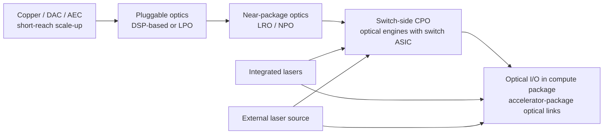
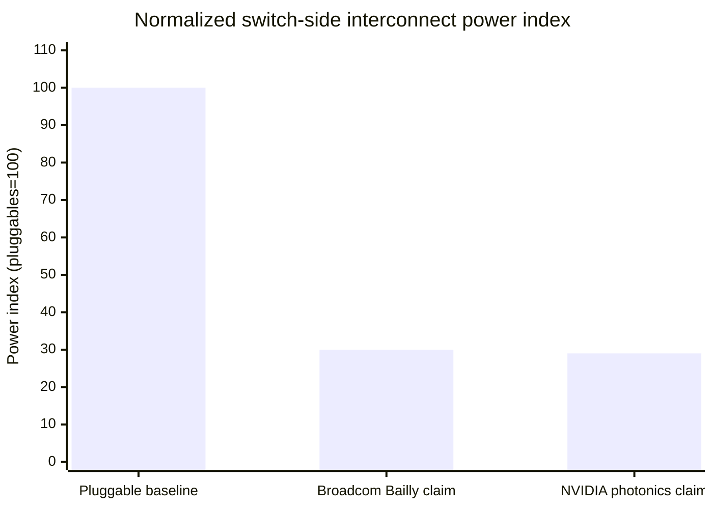
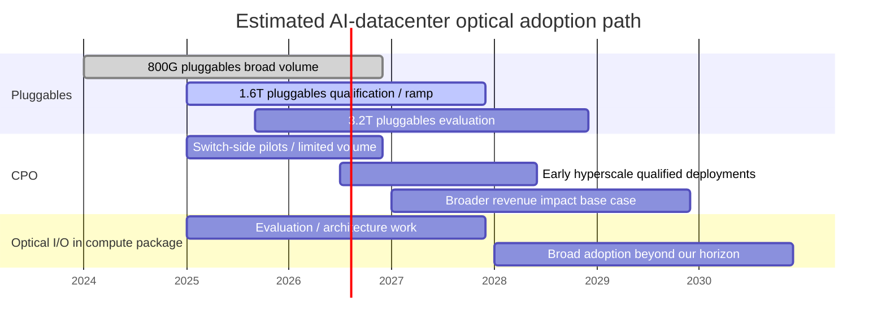
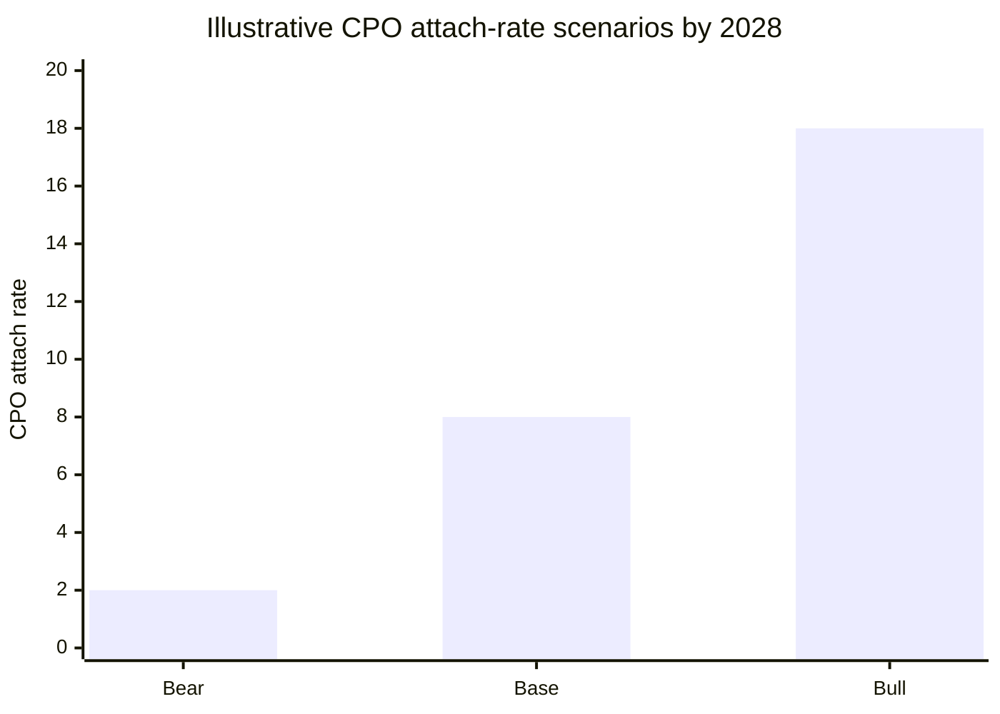

# Co-Packaged Optics in AI Datacenters

## Executive summary

This memo follows the scope, dimensions, and output format requested in the uploaded research brief. fileciteturn0file0

**Variant perception:** the market is broadly correct that optics must move closer to compute as AI clusters scale, but it is still overestimating how quickly that shift becomes a *broad hyperscale revenue event* for co-packaged optics. Over the next 12–24 months, the more likely profit pool remains concentrated in switch ASICs, SerDes/DSP, advanced pluggables, and packaging enablement, while mass CPO adoption is still gated by serviceability, yield, thermal control, fiber attach, and reliability at hyperscale operating standards. Broadcom is already shipping switch-side CPO, Nvidia is introducing photonics in networking, and TSMC’s COUPE ecosystem is real, but Nvidia has also said copper remains “orders of magnitude” more reliable for flagship GPU-to-GPU use today, and Broadcom has argued that within-rack scale-up should use direct-attached copper “as long as you can.” citeturn10news0turn9news0turn12view0turn46news2

The practical consequence is that the key debate is **not** “does CPO work?” It does, increasingly. The key debate is **when it becomes mandatory**, **where it is first deployed**, and **who captures the margin when optics move inside the box or package**. Recent public evidence points to a staged path: pluggable and near-package optical architectures continue to advance through 1.6T and early 3.2T demonstrations; switch-side photonics enters the market first; and optical I/O deeper inside accelerator packages remains later because serviceability and reliability standards are much harsher than a switch-topology pilot deck implies. citeturn19news1turn14academia5turn40academia4turn12view0

Our base case is that **2026–2027 brings meaningful pilots, qualifications, and limited-volume deployments at the switch layer, but not a broad revenue migration away from advanced pluggables across AI datacenters**. Under that base case, the best-positioned public names are those with exposure to switch silicon, high-speed SerDes/DSP, photonic-enablement IP, and packaging bottlenecks. Pure-play transceiver/module names still have runway if 1.6T pluggables and dense pluggable architectures extend farther than current CPO enthusiasm implies. citeturn9news0turn10news0turn32news1turn43news0turn22news1turn22news0

A second-order but important conclusion is that **hyperscaler scale is now large enough to make CPO strategically relevant, even if not yet broadly adopted**. Meta has published work on collectives for clusters exceeding 100,000 GPUs; Google’s TPU v4 system already used optical circuit switches with optics accounting for less than 5% of cost and less than 3% of system power; Oracle and OpenAI expanded Stargate to more than 5 GW and over 2 million chips; xAI has pursued nearly 2 GW of capacity and discussed 1 million-GPU-class buildouts; and Microsoft disclosed roughly $80 billion of AI datacenter investment for fiscal 2025. Those facts do not prove imminent CPO volume, but they do prove why the architecture question now matters to valuations. citeturn27academia4turn14academia9turn27news3turn27news2turn30news2

## Variant perception

The market debate is often framed as a straight-line technology substitution: once optics are co-packaged, lower power per bit and higher density should cause rapid adoption. That framing is incomplete. In our view, **the dominant issue for the next 12–24 months is margin capture under constrained adoption**, not pure technology readiness. The reason is simple: the early revenue opportunity is likely to accrue first to companies that control switch silicon, SerDes, photonic integration, and qualified packaging flows, while module assemblers and broader component suppliers only see a step-function upside if deployment becomes broad and standardized. citeturn10news0turn9news0turn32news1turn22news1turn22news0

Public signals support a staged adoption view. Broadcom has already shipped Bailly, a 51.2T switch with eight 6.4T silicon-photonics optical engines, and later shipped Tomahawk 6 at 102.4T. Nvidia has committed photonics to networking products beginning in late 2025 and 2026, but Jensen Huang explicitly said the company is **not** yet willing to use co-packaged optics on its flagship GPUs because copper is still much more reliable. That combination matters: it suggests that **switch-side CPO can be commercial before compute-package optical I/O is operationally acceptable at scale**. citeturn10news0turn9news0turn12view0

A useful way to think about the debate is as four overlapping questions:

| Debate axis | Why it matters now | Our weighting for the next 12–24 months |
|---|---|---|
| Timing arbitrage | Markets may pull forward broad adoption from pilot announcements | Very high |
| Margin capture | Switch ASIC and SerDes owners can absorb value from modules | Very high |
| Technology readiness | Silicon photonics and laser integration keep improving | High |
| Hyperscaler architecture | Cluster scale and serviceability determine whether CPO becomes mandatory | High |

The consensus mistake, in our judgment, is to treat pilot announcements, academic demonstrations, and foundry roadmaps as if they already imply broad attach-rate changes in 2026 earnings. The better framing is: **CPO is real, but the first investable question is who gets paid during qualification and early deployment, not who wins after universal adoption.** citeturn47news5turn14academia5turn40academia4turn12view0

## CPO architecture and technology readiness

At a high level, CPO places optical engines next to, or as part of, the switch/package complex so that the highest-speed electrical trace is drastically shortened. That directly attacks the power, signal-integrity, and front-panel density problems that arise as lane speeds move from 112G toward 224G and eventually beyond. But “CPO” is often used too loosely. In practice, the market needs to distinguish among **conventional pluggables**, **LPO/LRO/NPO-style near-package approaches**, **switch-side CPO**, and **optical I/O embedded much deeper into accelerator packaging**. Those are related, but not economically identical architectures. citeturn19news1turn20academia0turn22academia10

The technology stack is progressing on multiple fronts at once. In recent public work, researchers demonstrated 224G PAM4 in a 1.6T DR8 photonic integrated circuit and a variant capable of 400G per wavelength for 3.2T DR8. Separate work reported 3.2T and even 4.2T IM/DD transmission using a 3 nm SerDes with thin-film lithium niobate modulators. Those results matter because they show the pluggable roadmap itself is still moving, which reduces the urgency of broad CPO substitution in the near term. citeturn14academia5turn40academia4

At the same time, switch-side CPO is no longer theoretical. Broadcom’s Bailly integrated eight 6.4T silicon-photonics optical engines with Tomahawk 5 and claimed roughly 70% lower power than pluggable transceiver solutions; Broadcom then moved to Tomahawk 6 at 102.4T and described clusters of more than 100,000 processors. Nvidia, for its part, announced silicon-photonics networking products and publicly aligned them with TSMC’s COUPE path from 1.6T optical engines in OSFP-style modules, to 6.4T motherboard-level CPO, and ultimately to deeper in-package optical integration. citeturn10news0turn9news0turn19news1

Ayar Labs and Alchip’s in-package optical demonstrator at TSMC’s European OIP Forum is also important because it shows the foundry ecosystem is organizing around a **referenceable implementation flow** rather than bespoke research projects alone. Their COUPE-based subsystem combined a UCIe protocol chiplet, a low-power electrical interface die, Ayar’s TeraPHY photonic die, and a detachable fiber connector, with up to 100 Tb/s per accelerator in the reference concept. That is not the same thing as hyperscale volume deployment, but it is a meaningful sign that the toolchain is getting more product-like. citeturn47news5

The largest technical bottlenecks are still in **lasers, packaging, thermal control, and test**. Silicon photonics itself is no longer the only hard part; silicon’s indirect bandgap means practical light sources still require integration with III-V materials or other externalized light architectures. Foundry-focused work in 2024 emphasized that scalable silicon-photonics platforms still need effective laser and SOA integration strategies, while later work showed passive-alignment flip-chip laser bonding can work at high precision but remains nontrivial. That is one reason external laser source architectures remain attractive in practice: they are an engineering response to thermal and yield pain, even if the public evidence is still less mature than the associated investor narrative. The conclusion here is partly inference, but it is a well-grounded one. citeturn11academia2turn21academia2

Packaging and fiber attach are equally central. Recent papers showed about 1 dB coupling efficiency between silicon-nitride and polymer waveguides, sub-2 dB chip-to-chip and chip-to-fiber coupling, and compatibility with both chip-first fanout and flip-chip approaches. IBM-led work on next-generation CPO modules reported JEDEC-reliable optical modules using a 50-micron-pitch polymer-waveguide interface and argued that beachfront density could improve by roughly six times versus state-of-the-art approaches. A separate 2026 optical-interposer demonstration integrated photonic routing with InP-based active devices such as EMLs and photodetectors and delivered a 400-Gb/s single-fiber transceiver. These are strong technical signals, but they also underscore how many process steps and yield sensitivities sit between a paper and a hyperscale field-replaceable product. citeturn20academia0turn29academia13turn22academia10

Serviceability remains the biggest underappreciated blocker. Google’s TPU v4 used optical circuit switches successfully, but that design kept optics in a reconfigurable network layer rather than inside a hot compute package. Google explicitly reported that OCS and related optical components were less than 5% of system cost and less than 3% of system power, which shows hyperscalers will use optics where the operational model is manageable. By contrast, Nvidia’s public position in 2025 was that copper remains much more reliable for flagship GPU interconnects. That gap between “optics in the network” and “optics in the compute package” is where much of the market’s timing error sits. citeturn14academia9turn12view0

The chart above normalizes power to a pluggable baseline of 100 using Broadcom’s “70% lower power” claim for Bailly and Nvidia’s claim of roughly 3.5x better energy efficiency for its photonics networking products. These are vendor claims, and they refer to switch-side networking rather than general-purpose GPU package optics, but they capture why CPO matters architecturally even before it becomes ubiquitous. citeturn10news0turn12view0

The counterargument is therefore strong and should not be caricatured. Dense pluggable optics keep getting better. Public standards work is already aligned around 200G-per-lane electrical interfaces through OIF’s CEI-224G project and IEEE 802.3dj for 1.6T/200G-lane Ethernet; Arista has now made “XPO” and linear pluggable optics part of its AI-datacenter strategy; AWS is funding photonics chips for next-generation transceivers with STMicroelectronics; and recent 1.6T/3.2T pluggable optics demonstrations show the pluggable roadmap is still very much alive. That means the *crossover* to broad CPO could move later even as CPO itself becomes more real. citeturn40search2turn40search1turn43news0turn47news1turn14academia5turn40academia4

## Value capture across the stack

The CPO ecosystem is best understood as a stacked profit pool rather than a single market. The key layers are photonic die and optical engines; DSP/SerDes and switch silicon; lasers and light sources; advanced packaging, fiber attach, and test; ODM/EMS system integration; and hyperscaler architecture ownership. The crucial analytical point is that **gross margin is not evenly distributed across those layers**. In a world of early adoption, the highest-value layer is usually the one that owns the switch ASIC, integration architecture, and qualified high-speed electrical interface. In a world of delayed adoption, the value stays longer with merchant pluggable optics, DSP, AEC, and conventional transceiver assembly. citeturn10news0turn9news0turn32news1turn43news0

| Layer | Representative public companies | Representative private companies | Likely gross-margin profile | Early CPO winner | CPO delay winner |
|---|---|---|---|---|---|
| Photonic die / optical engines | Broadcom, Marvell, Intel, GlobalFoundries, TSMC ecosystem | Ayar Labs, Celestial AI, Lightmatter, Ranovus, Enosemi | Medium to high if IP-rich; lower if commoditized foundry supply | Silicon-photonics IP owners and vertically integrated switch vendors | Foundry service providers with broad customer exposure |
| SerDes / DSP / switch silicon | Broadcom, Marvell, Credo, Nvidia, AMD | DustPhotonics, XConn | Highest structural margins | Switch ASIC and SerDes owners | DSP and AEC vendors serving pluggables |
| Lasers / light source | Coherent, Lumentum, STMicroelectronics | Ayar-linked ELS ecosystems, specialized III-V suppliers | Medium; can compress with standardization | Laser specialists with qualified capacity | Pluggable transceiver suppliers that still buy their lasers |
| Packaging / substrate / test / fiber attach | ASE, Amkor, TSMC | Specialized OSAT and attach-tool vendors | Medium to low gross margin, but strategically scarce | Packaging houses with proven heterogeneous flows | Same names still benefit, but without mix shift |
| ODM / system integration | Fabrinet, Jabil, Sanmina, Celestica | Foxconn, Quanta | Low to medium | Volume system integrators only after meaningful ramps | Existing transceiver EMS stays busy longer |
| Hyperscaler architecture / demand control | Microsoft, Google, Meta, AWS, Oracle | OpenAI, xAI, Anthropic | Not a component margin pool, but sets standards and timing | The hyperscaler that standardizes first | The hyperscaler that extracts more vendor competition |

Three findings are especially important.

First, **switch silicon is where the economic leverage sits**. Broadcom’s product cadence from 51.2T Bailly to 102.4T Tomahawk 6, together with its continued role in hyperscaler custom silicon, shows precisely why the margin story is not mainly about who can assemble optical modules. The same logic applies to Marvell, which has pushed CPO/custom-XPU enablement, then added XConn for switching and later Celestial AI for photonics. Credo’s DustPhotonics acquisition points the same way: interconnect vendors are trying to move *up* from discrete connectivity into silicon-plus-optics integration because that is where the defensible value is likely to migrate. citeturn10news0turn9news0turn45news3turn45news0turn26news4turn32news1

Second, **packaging and test are bottlenecks, but not necessarily the largest long-term profit pool**. ASE expects advanced packaging and testing revenue to more than double to $1.6 billion in 2025, with 75% from leading-edge packaging and 25% from advanced testing. Amkor has also described itself as moving further “up the value chain,” including work with AMD and TSMC. Those data points matter because they confirm that packaging scarcity is real and monetizable. But OSAT economics remain structurally lower margin than proprietary switch silicon, SerDes IP, or hyperscaler architecture control. In other words, packaging scarcity can create tactical upside without overturning the hierarchy of who ultimately owns the industry profit pool. citeturn22news1turn22news0

Third, **pure transceiver vendors are not automatically the losers**. AWS’ collaboration with STMicroelectronics is aimed at a photonics chip for data-center transceivers, to be deployed in AWS infrastructure, and ST explicitly said it was also working with a leading pluggable transceiver supplier. That is concrete evidence that hyperscalers are still funding the pluggable roadmap. Coherent’s networking segment revenue rose 39% year over year to $945 million in a 2025 quarter, another reminder that the near-term AI optics boom is still predominantly a transceiver/pluggables story rather than a broad CPO revenue story. Investors who assume CPO imminently disintermediates the entire pluggable ecosystem are likely moving too early. citeturn47news1turn47news2

The hyperscaler pull is real but heterogeneous. Google has already demonstrated comfort with optics in system architecture via TPU v4’s optical circuit switches. Meta’s public papers show collective communication operating at more than 100,000 GPUs. AWS is funding transceiver-side photonic silicon and building enormous Trainium clusters. Microsoft’s strongest public signal remains sheer capex intensity rather than detailed photonics disclosures. Oracle and OpenAI are scaling multi-gigawatt datacenter projects that will eventually strain every network layer. xAI is pursuing similar massive builds. The unifying point is that **all of them need more bandwidth and lower power, but not all of them need to jump directly from pluggables to in-package compute optics on the same timetable.** citeturn14academia9turn27academia4turn47news1turn30news2turn27news3turn27news2

## Adoption triggers and signal dashboard

The most important adoption triggers are the ones that turn CPO from “interesting” into “architecturally mandatory.” That threshold is reached when the incremental cost and risk of keeping optics pluggable becomes worse than the integration pain of moving optics inside the switch or package. In our view, the most important triggers over the next 12–24 months are power per bit, switch bandwidth density, serviceability, and yield maturity. Standards and ecosystem work matter, but only after those four move far enough. citeturn10news0turn12view0turn19news1turn20academia0

| Trigger | Why it matters | Importance | Falsifiability over 12–24 months |
|---|---|---|---|
| Power-per-bit inflection | CPO must produce visible system-level watts savings at AI-cluster scale | Very high | High |
| Switch radix / bandwidth density limits | 102.4T and beyond tighten PCB reach and front-panel density | Very high | High |
| Serviceability / field replacement | Hyperscalers will not accept fragile non-replaceable optical failure modes | Very high | Medium |
| Yield maturity in photonic-electronic integration | Economic crossover fails without acceptable yield and test throughput | Very high | Medium |
| 224G electrical-reach pain | Higher lane speed shortens feasible electrical reaches and increases equalization cost | High | High |
| Hyperscaler architecture transition | Scale-up and scale-out topologies determine where optics move first | High | Medium |
| Packaging capacity | Without available CoWoS/SoIC/heterogeneous capacity, schedules slip | High | High |
| Standards / interoperability | Lowers buyer risk but does not substitute for reliability | Medium | Medium |

Two recent developments stand out as particularly useful. The first is Nvidia’s public choice to introduce photonics in networking before using it on flagship GPUs. That confirms a likely deployment order: **switch-side first, compute-package later**. The second is the 2026 launch of the Optical Compute Interconnect MSA by AMD, Broadcom, Nvidia, Meta, Microsoft, and OpenAI. That is a highly relevant signal because it shows hyperscalers and silicon vendors want a protocol-agnostic optical physical layer for scale-up AI systems, with a roadmap to 3.2T-class links. In other words, the standardization work is moving, but around a staged future, not a completed present. citeturn12view0turn46news1

The timeline above is our analytical estimate, not a vendor-confirmed deployment schedule. It is grounded in public signals from Broadcom, Nvidia, TSMC’s COUPE ecosystem, ongoing 1.6T/3.2T pluggable progress, and explicit reliability caveats from Nvidia. citeturn10news0turn9news0turn19news1turn47news5turn12view0turn14academia5turn40academia4

For day-to-day monitoring, the highest-quality **confirmation** signals are: first, hyperscaler or merchant-silicon disclosures showing switch-roadmap decisions that presume in-package optics rather than front-panel modules; second, foundry and OSAT commentary that specifically ties advanced packaging capacity or test infrastructure to silicon photonics/CPO programs; and third, standards activity or customer announcements that move from “framework” to interop or qualification milestones. The highest-quality **invalidation** signals are: first, rapid 1.6T pluggable shipment ramps with acceptable thermals and economics; second, credible 3.2T pluggable demos turning into qualification programs; and third, repeated customer language that prioritizes field serviceability and copper/LPO inside racks for another design cycle. citeturn22news1turn22news0turn46news1turn12view0turn43news0turn14academia5turn40academia4

A practical signal dashboard therefore looks like this:

| Signal | Type | Why it matters |
|---|---|---|
| Broadcom / Nvidia switch announcements tied to photonic packaging | Leading | Confirms architecture decisions made years before volume |
| TSMC / ASE / Amkor photonics packaging commentary | Leading | Captures whether process infrastructure is being reserved |
| OCI MSA interop milestones | Leading | Shows buyer confidence and ecosystem risk reduction |
| 1.6T pluggable production ramps | Leading-to-coincident | Strong pluggable roadmap delays CPO crossover |
| Coherent / Lumentum / AAOI optics mix commentary | Coincident | Indicates whether pluggables remain the principal volume path |
| Actual CPO engine revenue growth | Lagging | Important, but comes too late for most thematic positioning |

## Bottoms-up TAM and scenario model

Because public disclosure is incomplete, the model below is **illustrative and assumption-driven**. The least well-specified inputs in public data are AI accelerator shipment counts by cluster class, exact ports-per-accelerator by topology, and realized ASPs for CPO optical engines once sold in volume. That means the model should be used for scenario analysis rather than point forecasting.

### Model framework

We use the user’s requested structure in simplified form:

**AI accelerators shipped into AI datacenters**  
× **network-equivalent optical port demand per accelerator**  
× **optical attach rate**  
× **CPO attach rate versus pluggables**  
× **ASP per CPO optical port equivalent**  
× **silicon content capture ratio**  
= **revenue pool and gross-profit pool by layer**

For 2028, our base assumptions are intentionally conservative relative to the current hype cycle:

| Assumption | Bear | Base | Bull |
|---|---:|---:|---:|
| AI accelerators shipped into AI DCs | 5.5M | 6.5M | 8.0M |
| Network-equivalent optical port demand per accelerator | 4.5 | 5.0 | 5.5 |
| Optical attach rate | 75% | 80% | 85% |
| Eligible optical port equivalents | 18.6M | 26.0M | 37.4M |
| CPO attach rate | 2% | 8% | 18% |
| CPO optical port equivalents | 0.37M | 2.08M | 6.73M |
| CPO ASP per port equivalent | $850 | $950 | $1,050 |

That produces the following **illustrative CPO subsystem revenue pools**:

| Scenario | Estimated 2028 CPO subsystem revenue | Interpretation |
|---|---:|---|
| Bear | ~$0.3B | Pilots and limited switch-side deployments only |
| Base | ~$2.0B | Qualified switch-side adoption, still narrow by hyperscaler |
| Bull | ~$7.1B | Earlier-than-expected mandatory adoption in selected AI fabrics |

The most important sensitivity is **attach rate**, not ASP. In the base case, each additional 1 percentage point of CPO attach on 26.0 million eligible optical port equivalents adds roughly **260,000 ports** and about **$247 million** of subsystem revenue at a $950 ASP. By contrast, a 10% move in ASP around the same base changes revenue by about **$198 million**. A third critical variable is the **silicon content capture ratio**: if switch/SerDes/photonics-IP suppliers capture 45% of subsystem revenue rather than 35%, the gross-profit pool shifts materially toward names like Broadcom, Marvell, Nvidia, or IP-rich enablers rather than packaging houses or module assemblers. These are memo estimates, but they illustrate why margin capture matters more than raw optics TAM. 

A reasonable base-case split of the **revenue** pool is:

| Layer | Base-case share of CPO revenue | Typical gross-margin character |
|---|---:|---|
| Switch ASIC / SerDes / photonics IP | 40–50% | Highest |
| Lasers / optical active components | 20–25% | Mid |
| Packaging / fiber attach / test | 15–20% | Mid-to-low |
| ODM / system integration | 10–15% | Lowest |

On a **gross-profit** basis, the concentration is even more skewed toward switch silicon and integration IP because OSAT and EMS margins are structurally lower. This is the core reason we think the market often misprices CPO by focusing on optical unit volumes rather than on *which layer owns the economic rents*.

## Public company exposure and investment implications

The table below is an analytical assessment of 12–24 month thematic exposure based on the cited public evidence above. “Direct” means the company clearly touches a likely near-term monetization layer of the CPO stack; “indirect” means it benefits from AI optical/network spend but not necessarily from broad CPO adoption itself; “speculative” means the strategic logic is present but near-term revenue evidence is still thin.

| Company | Layer | Relevance to CPO theme | 12–24 month revenue sensitivity | Margin capture potential | Exposure type | Best catalyst to monitor | Key risk |
|---|---|---|---|---|---|---|---|
| Broadcom | Switch ASIC, CPO, custom silicon | Highest-confidence direct exposure; already shipped 51.2T CPO and 102.4T switch silicon | High | Very high | Direct | Customer qualification language around Bailly/Davisson/Tomahawk 6 and hyperscale deployments | CPO slips while customers keep copper/pluggables longer |
| Marvell | Custom silicon, switching, photonics, DSP | Strong strategic exposure via CPO custom-XPU positioning, XConn, and Celestial AI | Medium-high | High | Direct | Evidence of customer design wins converting to volume revenue | Integration risk and competition from Broadcom/Nvidia |
| Nvidia | Networking photonics, AI fabric | Direct at switch/network layer, but explicitly delaying flagship GPU-package optics | Medium | High | Direct | Photonics networking ramp in late 2025/2026 and networking revenue mix | Reliability constraints keep optics outside compute longer |
| Credo | SerDes, DSP, AEC, optical transceivers | Beneficiary whether CPO is early or late; especially strong if pluggables/AEC persist | Medium-high | High | Direct | DustPhotonics integration and adoption of optical + AEC portfolio | If broad CPO internalizes more value inside switch silicon |
| Coherent | Lasers, transceivers, networking optics | Important optics supplier, but more vulnerable to market timing debate | Medium | Medium | Indirect | Networking segment trajectory and share in next-gen transceivers | Investor pull-forward of CPO disintermediation fears |
| Lumentum | Lasers and optical components | Similar to Coherent: exposed to AI optics, but less direct to switch-side CPO value capture | Medium | Medium | Indirect | Laser-capacity commitments and AI datacenter optics bookings | Same timing/attach-rate risk as Coherent |
| Applied Optoelectronics | Transceivers, laser components | Benefits most if 800G/1.6T pluggables remain strong longer | Medium | Low-to-medium | Indirect | 800G/next-gen transceiver manufacturing ramps | Value shifts toward integrated switch-side optics |
| Fabrinet | Assembly / EMS / optical manufacturing | Volume beneficiary, not rent owner | Low-to-medium | Low | Indirect | Customer signals on 1.6T/next-gen optical assembly demand | Mix shift without margin expansion |
| Arista | Systems, AI networking, XPO/LPO strategy | Useful hedge on pluggable roadmap durability | Medium | Medium | Indirect | Customer adoption of XPO/LPO strategy | Merchant silicon suppliers internalize economics |
| Cisco | Systems, optics, optical module ecosystem | Exposure exists, but direct CPO upside less obvious near-term | Low-to-medium | Medium | Indirect | Silicon/optics roadmap disclosures | Share loss in AI switching |
| AMD | Accelerator + photonics intent via Enosemi | Strategic but still early; near-term revenues likely limited | Low | Medium | Speculative | Concrete product disclosures linking optics to AI systems | Optics remains networking-side rather than accelerator-side |
| TSMC | Foundry / packaging enabler | Essential ecosystem enabler via COUPE and advanced packaging | Medium | Medium | Direct | COUPE ecosystem traction and photonics customer count | Enablement value captured more by customers than by TSMC |
| GlobalFoundries | Silicon photonics foundry | Attractive enabling exposure after AMF acquisition | Low-to-medium | Medium | Direct | Silicon-photonics customer additions and volume programs | Long payback and customer concentration |
| ASE | Packaging / advanced testing | Scarcity beneficiary as integration complexity rises | Medium | Medium | Direct | Advanced packaging and testing revenue mix | OSAT margin ceiling |
| Amkor | Packaging / advanced packaging buildout | Similar to ASE, especially if more U.S.-centric packaging is needed | Medium | Medium | Direct | Customer expansion at advanced-packaging campuses | Execution and utilization risk |
| Intel | Silicon photonics / historical capability | Strategically relevant, but near-term AI-CPO catalyst less visible in current public evidence reviewed | Low | Medium | Speculative | Fresh silicon-photonics product/customer disclosures | Strategy execution uncertainty |

The way to read that table is straightforward. **Broadcom** is the cleanest single-stock expression of switch-side CPO optionality because it combines switch silicon, photonic integration, and hyperscaler custom-silicon relationships. **Marvell** is the highest-beta strategic challenger because it spans custom XPU enablement, switching, photonics, and optical DSP, but it has more execution dependence. **Nvidia** is a networking-photonics winner without being a near-term GPU-package- optics winner, which is a subtle but important distinction. **Credo** is the best “both ways” name if one believes pluggables, LPO, AEC, and optical connectivity remain durable while CPO takes longer to mature. citeturn10news0turn9news0turn45news3turn45news0turn26news4turn12view0turn32news1turn32news6

On the other side, the companies most vulnerable to market mis-timing are those where investors are already tempted to capitalize a future CPO-driven photonics boom into near-term earnings. The evidence gathered here does not support a broad-based collapse in pluggable transceiver economics over the next 12–24 months. AWS is still funding transceiver-side photonics; Arista is leaning into extra-dense pluggables and LPO; Broadcom itself has publicly talked down near-term optical scale-up inside racks; and Nvidia’s reliability comments make clear that deeper optical integration still has work to do. That does **not** make optical suppliers bad businesses. It does mean the near-term winners may be different from the terminal-state winners. citeturn47news1turn43news0turn46news2turn12view0

### Consensus mistakes

The most common analytical mistakes in this theme are remarkably consistent.

The first is **equating CPO with any optics getting closer to silicon**. Near-package optics, LPO, optical I/O, optical engines, and conventional pluggables are not the same architecture and do not redistribute margins the same way. The second is **treating press releases and conference demos as proof of broad hyperscale deployment**. Broadcom, Nvidia, TSMC, and Ayar Labs have all provided important evidence of readiness, but those proofs are still a long way from making compute-package optical links a default operating model across AI datacenters. citeturn10news0turn19news1turn47news5turn12view0

The third mistake is **underestimating how durable the pluggable roadmap can be**. Recent 1.6T and 3.2T public demonstrations, active standards work around 200G-per-lane electrical interfaces, AWS’ transceiver-side photonics investment, and Arista’s XPO/LPO strategy all argue that pluggables and related optical architectures may extend further than many fast-money CPO narratives assume. citeturn14academia5turn40academia4turn40search2turn40search1turn47news1turn43news0

The fourth mistake is **confusing optics TAM with profit-pool capture**. Even if CPO subsystem revenue grows quickly, the highest-value layer may still be switch silicon and SerDes rather than optical assembly. The fifth is **ignoring serviceability and reliability as first-order adoption variables**. Nvidia’s public comments should have ended the idea that compute-package optics is already operationally solved. They did not. That continuing gap is where variant perception still exists. citeturn12view0turn10news0turn32news1

### Bull, base, and bear scenario table

| Scenario | Core assumption | Adoption timeline | Main catalyst | Best-exposed public names | Most at-risk public names | Revenue inflection | Margin impact | Key invalidation signal | 12–24 month actionability |
|---|---|---|---|---|---|---|---|---|---|
| Bull | Switch-side CPO becomes a required architecture for major new AI fabrics sooner than expected | Visible in 2026 qualification, stronger in 2027–2028 | Multiple hyperscaler qualifications plus packaging capacity reserved | Broadcom, Marvell, Nvidia, TSMC, ASE, Amkor | AAOI, weaker module assemblers, pure-play pluggable skeptics | Earlier | Positive for switch silicon, mixed for optics components | 1.6T/3.2T pluggables prove “good enough” | Selective long in integrated silicon/enablers |
| Base | CPO advances, but broad adoption remains limited to specific switch/network layers while pluggables still dominate volume | Pilot-heavy 2026, gradual monetization in 2027–2028 | Networking-product shipments and standards progress, not broad compute-package rollout | Broadcom, Credo, Nvidia, Marvell, TSMC, packaging names | Overhyped optics names priced for immediate attach-rate jump | Moderate | Profit stays with ASIC/SerDes; pluggables still monetize | Rapid serviceability solution and major hyperscaler standardization | Barbell: integrated silicon plus durable pluggable beneficiaries |
| Bear | 1.6T/3.2T pluggables, AEC, and LPO extend the roadmap by 3–5 years; CPO remains niche | Broad impact slips past 2028 | Dense pluggables ramp, copper/LPO remains preferred within racks | Credo, Coherent, Lumentum, AAOI, Arista, Fabrinet | Companies priced for near-term CPO attach-rate step-up | Delayed | Module/DSP margin pools persist longer | Multiple large-scale CPO deployments with field-service evidence | Prefer pluggable and connectivity incumbents |

### Final investment conclusion

The highest-confidence conclusion is that **CPO is strategically inevitable in some form, but not yet a broad 2026 earnings event across AI datacenters**. The public evidence now supports three simultaneous truths: switch-side CPO is real and shipping; the underlying photonics and packaging toolchain is getting materially better; and hyperscalers still have strong reasons to prefer copper, AEC, LPO, or pluggables where serviceability and reliability dominate theoretical power savings. citeturn10news0turn9news0turn47news5turn20academia0turn12view0turn43news0

For a buy-side portfolio over the next 12–24 months, that means the cleaner setup is usually **not** “buy any optics stock with a CPO slide.” It is to favor companies that can win in either outcome, or that own the layer where margin pools are likely to concentrate first. In practice, that favors **Broadcom** most clearly, keeps **Marvell** and **Nvidia** highly relevant with more timing/execution nuance, and makes **Credo** unusually attractive as a hedge on the durability of pluggables, LPO, AEC, and optical-DSP/SerDes content. Packaging houses like **ASE** and **Amkor** are credible second-order beneficiaries, but they are enabling bottlenecks more than ultimate rent owners. citeturn10news0turn9news0turn45news3turn32news1turn22news1turn22news0

The biggest mispricing opportunity, in our view, is therefore this: **the market is underestimating how long advanced pluggables can coexist with early CPO, and underestimating how much of the early value accrues to switch silicon and SerDes rather than to optical module assembly.** If that view is correct, near-term thematic alpha comes from avoiding the false binary. The winning positioning is a barbell: own the integrated silicon and packaging bottlenecks that benefit from early CPO, while also respecting the durability of the pluggable roadmap that can keep conventional optics revenue stronger for longer. citeturn47news1turn43news0turn14academia5turn40academia4turn12view0

### Open questions and limitations

Some items remain incomplete in public evidence. Fresh, primary-source disclosures on **Intel’s specific near-term AI-CPO roadmap**, detailed **OSFP-XD public standard documentation**, and broad, customer-verified **field-service models for failed co-packaged optical engines** were limited in the sources reviewed. The report therefore treats those areas more cautiously than the better-documented Broadcom, Nvidia, TSMC, packaging, and hyperscaler-capex datapoints above.