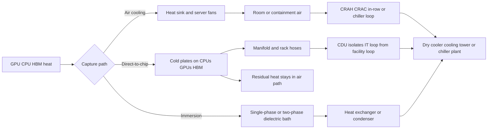
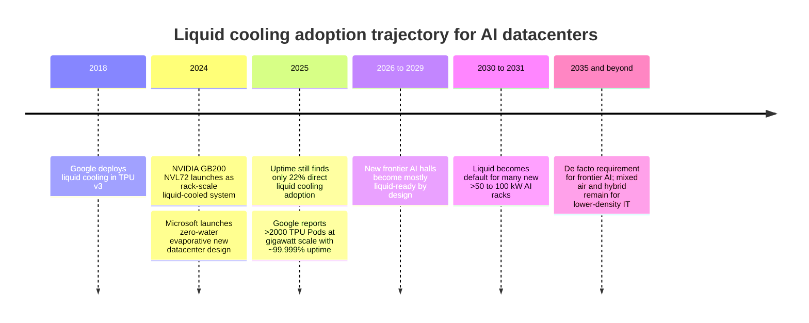

# Liquid Cooling for AI Datacenters

## Executive summary

Liquid cooling has moved from a niche HPC technique to a core design requirement for frontier AI infrastructure. The basic reason is straightforward: AI-optimized datacenters are adding power faster than air can economically and reliably remove heat. Cooling already accounts for roughly **7% of load in efficient hyperscale sites and more than 30% in less-efficient enterprise sites**, while the IEA projects **AI-optimized datacenter electricity demand to more than quadruple by 2030**. At the hardware level, current rack-scale AI systems such as NVIDIA GB200 NVL72 and GB300 NVL72 are **fully liquid-cooled**, and publicly discussed roadmaps now point toward **hundreds of kilowatts per rack today and 1 MW racks on the horizon**. citeturn5search0turn5search12turn31view0turn31view1turn17view6

For **frontier AI training and dense inference clusters**, liquid cooling is no longer optional in practice. Uptime Institute’s 2024–2025 surveys show that operators already see **direct liquid cooling as necessary once rack density moves beyond roughly 20 kW**, while Dell documents that customers typically still air-cool up to around **30 kW per rack** and Schneider indicates conventional air designs remain most viable below roughly **35 kW per rack**. That means liquid cooling is becoming the default for new high-density AI halls, even though most datacenters overall are still predominantly air-cooled today. citeturn9view1turn39view0turn12search10

Liquid cooling is not automatically the “best” answer for every site, every workload, or every climate. Its strongest advantages are **thermal headroom, rack density, lower auxiliary energy, and better heat-reuse potential**. Its weakest points are **upfront complexity, commissioning difficulty, interoperability, coolant management, and a younger supply chain**. Microsoft’s 2025 Nature study is especially important because it moves beyond marketing claims: relative to air cooling, it found **cold plates and immersion** can reduce **life-cycle greenhouse-gas emissions by 15–21%, energy demand by 15–20%, and blue-water consumption by 31–52%**, although results depend on design assumptions and electricity mix. citeturn7view0turn33view2

Will liquid cooling become “mandatory”? The best evidence supports a **split answer**. For dense AI infrastructure, yes, increasingly and soon. For general enterprise IT, storage-heavy estates, low-density colocation, and many edge workloads, no: **air and hybrid air/liquid designs will remain viable for years**. The near-term battleground is not physics but execution: CDUs, manifolds, fluid cleanliness, leak sensing, trained staff, heat-rejection design, standards, and vendor capacity can all become major deployment bottlenecks if the industry scales faster than its operational discipline. citeturn9view0turn15view1turn15view2turn38view2turn9view2

## Why liquid cooling matters now

AI infrastructure is pushing rack density into a range where air cooling stops being economical or even feasible. NVIDIA’s GB200 NVL72 is a **rack-scale liquid-cooled system** connecting 72 Blackwell GPUs and 36 Grace CPUs in one rack, and the GB300 NVL72 is likewise **fully liquid-cooled**. Schneider’s NVIDIA-aligned reference designs support **up to 142 kW per rack**, Vertiv’s GB200 reference architecture supports **up to 132 kW per rack**, and CoreWeave’s public GB300 deployment example is about **140 kW per rack**. Those are not future concepts; they are current commercial reference points. citeturn31view0turn31view1turn34view0turn20search15turn20search6

That density matters because industry surveys still show air cooling dominating the installed base. In Uptime Institute’s 2025 cooling survey, **perimeter air cooling remained the most common option at 75%**, while **direct liquid cooling was in use at 22%**. But the same survey found that **higher rack densities** are the top driver of DLC adoption, and Uptime’s 2024 survey found most respondents believe air cooling becomes too costly or inadequate above about **20 kW per rack**. citeturn9view0turn9view1

The physics works in liquid cooling’s favor because liquids transport heat more effectively than air and can take heat directly from the hottest components instead of first warming the whole room. Schneider states that water has **over 23 times higher thermal conductivity than air** and can store roughly **3,000 times more heat per unit volume**, while Google notes that liquid-cooled ML servers can have **nearly half the geometrical volume** of comparable air-cooled counterparts. In practice, that translates into denser racks, less fan power, and less dependence on room-level HVAC. citeturn34view0turn14search2

The more interesting question is whether liquid cooling is reliable enough at scale. The strongest public evidence says yes—if designed and operated properly. Google reports it has deployed liquid cooling at **gigawatt scale across more than 2,000 TPU Pods** over seven years with uptime of about **99.999%**, beginning with TPU v3 in 2018. That does not erase leak and maintenance risks, but it shows liquid cooling is not merely experimental for hyperscale AI. citeturn14search2

The current design reality is usually hybrid rather than 100% liquid everywhere. Vertiv states that **direct-to-chip cooling typically removes about 70–75% of rack heat**, leaving a residual **25–30%** that still must be handled by air or another secondary path. Schneider similarly notes that air cooling remains necessary for a residual share of heat even in many liquid-cooled AI deployments. This is why rear-door heat exchangers and hybrid room designs are strategically important—not just direct-to-chip cold plates and immersion tanks. citeturn19view2turn12search2

The reason the industry is standardizing around CDUs, cold plates, manifolds, quick disconnects, and leak sensors is that liquid cooling is now systemic infrastructure, not a server accessory. OCP’s 2024–2026 liquid-cooling contributions emphasize that **air cooling cannot always address high-TDP devices**, that the **CDU is a key ingredient** for scaling liquid cooling, and that advanced AI systems make the transition to liquid cooling effectively **inevitable**. citeturn15view1turn38view1turn38view2

## Air cooling versus liquid cooling

The comparison below is intentionally decision-oriented rather than marketing-oriented. The right answer depends on rack density, retrofit constraints, climate, water availability, and workload criticality.

| Dimension | Air cooling | Liquid cooling | Analytical takeaway |
|---|---|---|---|
| Thermal performance | Best at lower densities and simpler server footprints; performance degrades as rack power rises and hot spots intensify. | Removes heat closer to the chip; supports much higher heat flux and higher-TDP CPUs/GPUs. | Air remains viable for many legacy and moderate-density halls, but AI-class racks increasingly exceed its practical/economic envelope. citeturn9view1turn34view1turn15view1 |
| PUE and energy efficiency | Can be excellent in top-tier hyperscale designs with favorable climates and economization. | Usually lowers fan/compressor work at high density; can also improve IT efficiency by reducing thermal throttling. | PUE often improves, but PUE alone can mislead because liquid cooling changes both facility overhead and IT-side efficiency; Vertiv/NVIDIA argue broader metrics such as TUE/ITUE are more informative. citeturn5search0turn7view0turn19view2turn18view0 |
| Rack and server density | Typical practical air-cooled thresholds are around 20–30 kW/rack; some optimized designs stretch higher. | Commercial AI designs already operate around 100–142 kW/rack, with 1 MW racks publicly discussed by Google. | Liquid cooling’s biggest near-term advantage is density. It enables more compute per hall, per MW, and often per square foot. citeturn9view1turn39view0turn34view0turn20search15turn17view6 |
| Capital costs | Lower initial cost and simpler retrofit at low density; highly commoditized supply chain. | Higher upfront server and facility cost from cold plates, CDUs, manifolds, piping, controls, and commissioning. | At low density, air is usually cheaper. At high density, liquid can lower total cost by shrinking footprint, lowering auxiliary energy, and avoiding overbuilding airflow infrastructure. citeturn9view0turn18view2turn27search5 |
| Operating costs | Fan energy and room-level refrigeration costs rise sharply with density. | Lower fan power, warmer-water operation, and better heat rejection can reduce operating cost materially. | The economic crossover point is density-dependent: liquid cooling’s OPEX case strengthens rapidly as racks get hotter. citeturn18view0turn18view2turn19view2turn27search5 |
| Reliability and maintenance | Mechanically simpler, with mature operating playbooks; but more server fans and greater thermal spread. | Adds pumps, hoses, fluid chemistry, filtration, leak detection, and commissioning discipline; can reduce throttling and fan-related failure points. | Liquid is not inherently less reliable, but it is less forgiving of poor commissioning and fluid management. Google’s gigawatt-scale record shows it can be highly reliable when engineered well. citeturn14search2turn15view2turn38view0turn9view0 |
| Water use and environmental impact | Dry-air systems can use little on-site water; evaporative systems can use substantial water depending on climate. | Can be closed-loop and near-zero-evaporation on-site, or tower-assisted depending on design; often lowers life-cycle energy, carbon, and blue-water use. | “Liquid cooling” does **not** automatically mean “more water.” Water outcomes depend heavily on the heat-rejection architecture. Microsoft’s newest closed-loop designs and NREL’s examples show zero/near-zero evaporation is possible. citeturn33view1turn33view3turn18view1turn9view3turn7view0 |
| Deployment complexity | Easier to understand, procure, and operate; simpler brownfield changes. | Requires system architecture choices: CDU type, facility loop, fluid quality, filtration, redundancy, leak sensing, controls, and service clearances. | Liquid cooling is more a facilities-and-operations program than a server feature. Execution quality is a major differentiator. citeturn13view0turn15view2turn9view0 |
| Supply-chain constraints | Mature and broad global supplier base. | Vendor choice, interoperability, and standards are still improving; some components can be capacity-constrained. | The cooling bottleneck is increasingly industrial rather than scientific: CDUs, manifolds, sensors, qualified contractors, and standard interfaces matter. citeturn9view0turn9view1turn15view1turn38view2 |

A few hard data points are especially useful for context. NREL’s ESIF warm-water liquid-cooled HPC datacenter reported **PUE around 1.03–1.06**, **no mechanical cooling**, and racks at **60–80 kW** with waste-heat recovery, while Microsoft’s 2025 life-cycle study found meaningful reductions in energy, emissions, and blue-water use from cold plates and immersion relative to air. Those are not perfect apples-to-apples comparisons to every commercial site, but they show why liquid cooling is so attractive when density is high and design is integrated. citeturn18view0turn18view1turn7view0turn33view2

## Will liquid cooling become mandatory

For **frontier AI datacenters**, the answer is increasingly **yes in practice**. Current flagship NVIDIA systems are explicitly liquid-cooled, OEMs such as Dell, HPE, Lenovo, Supermicro, Vertiv, and Schneider/Motivair are building around liquid-first architectures, and Google is openly preparing the industry for **1 MW racks**. Microsoft says it is **transitioning from traditional air-cooled datacenters to chip-level liquid cooling designs at all owned datacenters**, while also rolling out a new generation of datacenter design with **zero water evaporation for cooling**. citeturn31view0turn31view1turn25search1turn26search6turn41search5turn27search5turn17view6turn32search6turn33view1

For **the broader datacenter market**, the answer is **no, not universally**. Uptime’s 2025 survey still shows DLC at only **22%** adoption, with **perimeter air cooling at 75%**, and Uptime explicitly argues the liquid-cooling revolution is likely to favor AI training first while bypassing mainstream enterprise IT for several years. That conclusion is consistent with Dell’s planning guidance that many customers still air-cool up to **30 kW/rack**, and with OCP’s emphasis on hybrid architectures such as rear-door heat exchangers for transition scenarios. citeturn9view0turn9view2turn39view0turn37view0

The most defensible way to answer the “mandatory” question is with scenarios:

**Three-year scenario.** By the late 2020s, most new greenfield AI training halls and premium colo AI suites are likely to be **liquid-ready by default**, even if they initially deploy hybrid air/liquid systems. Brownfield upgrades will lean heavily on **rear-door heat exchangers and direct-to-chip for selected rows**, not all-hall immersion. This is the most likely path because retrofit ease is operators’ top viability criterion and because direct liquid cooling is still being adopted gradually, not explosively. citeturn9view0turn37view0turn13view0

**Five-year scenario.** By the early 2030s, liquid cooling is likely to be the **default design assumption** for new high-density AI facilities, especially where rack power is routinely above **50–100 kW**. That is broadly aligned with Vertiv’s public statement that by the end of the decade datacenters will primarily rely on **liquid-cooling to the chip**, immersion, and residual air paths. It is also consistent with OEM roadmaps from Dell, HPE, Lenovo, and NVIDIA, all of which are commercializing liquid-cooled AI systems now rather than talking about them as future options. citeturn19view0turn25search10turn26search6turn41search5turn31view1

**Ten-year scenario.** If rack powers continue on the currently visible path toward **hundreds of kilowatts and possibly 1 MW**, liquid cooling becomes **effectively mandatory for frontier AI infrastructure**. The “air-only AI factory” would then be a niche exception. But even in that world, air cooling should remain common for lower-density enterprise compute, storage, network gear, and parts of mixed-use facilities. In other words: liquid cooling is on track to become mandatory for **the leading edge of AI**, not for **all datacenter compute everywhere**. citeturn17view6turn14search2turn9view2

## Where liquid cooling can become a bottleneck

Liquid cooling can absolutely become a major bottleneck—but usually because of **deployment friction**, not because the underlying physics is inadequate. The main bottlenecks fall into four categories.

### Technical bottlenecks

Current direct-to-chip systems use **narrow flow channels**, often on the order of **100 microns**, which makes system cleanliness critical. OCP’s pre-commissioning guidance stresses that pipework must be hydrotested, cleaned, flushed, and prepared properly because construction debris, corrosion by-products, and dirt can foul cold plates and degrade heat transfer. OCP’s cold-plate documents also emphasize that material compatibility, hydrostatic testing, temperature cycling, and leak detection are central to reliability. citeturn15view2turn38view1

Leak risk is real enough that OCP published a dedicated **rope leak sensor specification** in 2026 for single-phase direct-to-chip systems, stating that advanced AI chips make the transition to liquid cooling inevitable and that leak detection and mitigation are therefore crucial. The existence of this specification is not a sign that liquid cooling is failing; it is evidence that the ecosystem is industrializing around failure modes that air systems largely did not have. citeturn38view2

Another technical bottleneck is that **direct-to-chip is rarely fully self-sufficient**. Since roughly **20–30%** of rack heat may remain in an air path, facilities that underestimate secondary cooling, airflow, or rear-door performance can still suffer hotspots even after “going liquid.” That is one reason hybrid architectures are proliferating. citeturn19view2turn37view0

### Logistical and workforce bottlenecks

Uptime’s 2025 survey shows that operators judge liquid cooling viability first on **ease of retrofit into existing infrastructure (46%)**, followed by lower operating cost and ease of maintenance. The same survey names **lack of standardization (39%)**, **expense (38%)**, **reliability concerns (35%)**, and **maintenance issues (26%)** among the biggest barriers. In other words, the bottleneck for many operators is not whether liquid cooling works, but whether they can integrate, service, and trust it in their own environment. citeturn9view0

Commissioning is a particularly underappreciated bottleneck. OCP’s row-manifold guidance makes clear that liquid-cooled deployments require more planning and coordination than air-cooled rooms, including water source verification, wastewater handling, spill containment, chemistry management, and documentation of all wetted materials and procedures. These are facilities disciplines, not pure IT tasks, and many teams are still learning them. citeturn15view2

### Supply-chain and interoperability bottlenecks

The liquid-cooling supply chain is improving quickly, but it is still less mature and interchangeable than the air-cooling ecosystem. Uptime’s 2024 and 2025 surveys show persistent concern about **limited equipment/vendor choice** and **supply-chain difficulties**, with **lack of standardization across systems** becoming the leading barrier in 2025. OCP’s recent work on CDUs, cold plates, row manifolds, and leak sensors exists precisely because interoperability is not yet frictionless. citeturn9view0turn9view1turn15view1turn38view2

Uptime also warns that hyperscale AI demand can pull manufacturing and engineering attention toward AI training first, leaving conventional enterprise IT following behind. That means lead times, product priorities, and even standards may be shaped disproportionately by the needs of a few large AI customers. citeturn9view2

### Regulatory and resource bottlenecks

Water is the most misunderstood issue. Some liquid-cooled systems are **closed-loop and near-zero evaporation**, while others rely on cooling towers, dry coolers, adiabatic systems, or mixed arrangements. Microsoft’s next-generation design aims for **zero water evaporation for cooling** and says it can avoid **more than 125 million liters of water per year per datacenter**. NREL’s examples show how dry/hybrid heat rejection can sharply reduce water use. But Uptime is right that **water is local**: water use depends heavily on climate, design, and heat-rejection choice. citeturn33view1turn18view1turn9view3

Coolant chemistry is the second regulatory bottleneck. Microsoft’s study notes that while two-phase immersion can perform well, some variants rely on **PFAS-based fluids**, which face regulatory scrutiny in the US and EU; Microsoft says it is **not currently using immersion cooling technologies in datacenter operations** for that reason. OCP’s leak-sensor specification also explicitly references compliance with **UL, CE, RoHS, and REACH** for components used in liquid-cooled systems. citeturn33view2turn38view2

The bottom line is that liquid cooling can become a bottleneck if the industry underinvests in **standards, commissioning, fluid management, and trained labor**. If those are handled early, liquid cooling is more likely to be an enabler than a constraint. citeturn9view0turn15view2turn15view1

## Vendor landscape

The table below is a **selected** vendor map focused on companies with publicly visible AI/HPC liquid-cooling offerings and reasonably clear primary-source documentation. It is not exhaustive, and public customer disclosures vary widely.

| Company | Representative product | Cooling approach | Target workloads | Typical deployment scale | Maturity | Publicly disclosed customers or collaborators | Primary sources |
|---|---|---|---|---|---|---|---|
| Schneider Electric / Motivair | EcoStruxure liquid cooling portfolio; Motivair ChilledDoor; NVIDIA reference designs RD110/RD111 | Direct-to-chip, CDU ecosystem, rear-door heat exchanger | AI, GPU clusters, HPC, brownfield and greenfield datacenters | Rack, row, hall; Schneider says experience beyond 400 kW racks and GB300 reference designs at 142 kW/rack | Commercial | NVIDIA; legacy Motivair deployments in Cray/HPC environments | citeturn12search3turn34view0turn13view1 |
| Vertiv | CoolChip CDU 121 / 600 / OCP Deschutes variants | In-rack and row CDUs for direct-to-chip; supports rear-door applications | AI, HPC, retrofits, high-density racks | ~100 kW+ rack scale to 600 kW product family; Deschutes-based variant up to 2 MW | Commercial | NVIDIA; CoreWeave | citeturn20search8turn20search14turn20search3turn20search6turn20search15 |
| Dell Technologies | PowerEdge XE9780L/XE9785L, IR7000 rack, PowerCool eRDHx | Direct-to-chip liquid cooling; enclosed rear-door heat exchanger | Enterprise AI, rack-scale AI, inference, simulation | Rack and multi-rack; up to 192–256 Blackwell Ultra GPUs per IR7000 rack; IR7000 liquid-ready to 480 kW | Commercial | Core42; NVIDIA AI Factory ecosystem | citeturn25search1turn25search10turn25search11turn29view0 |
| HPE | 100% fanless Direct Liquid Cooling; HPE Cray EX | Closed-loop direct liquid cooling | AI supercomputing, HPC, service-provider AI clusters | Cabinet/rack scale; HPE cites up to 400 kW per rack and Cray EX liquid-cooled systems | Commercial | KDDI; multiple top supercomputers | citeturn26search0turn26search3turn26search6turn26search7 |
| Lenovo | Neptune; ThinkSystem N1380 Neptune chassis | Direct water cooling, liquid-assisted cooling, chassis-level warm-water cooling | AI, HPC, dense GPU/CPU clusters | Server, rack, hall; 100 kW+ racks and, in some designs, near-100% heat removal | Commercial | Harvard University; Wuhan University of Technology | citeturn41search2turn41search4turn41search5turn41search11turn41search8 |
| Supermicro | DLC-2; Data Center Building Block Solutions | Direct-to-chip plus CDU/tower ecosystem | AI factories, HPC, liquid-cooled cluster deployments | Rack to facility scale; integrated racks and liquid-cooled AI clusters | Commercial | Getworks / Yuzawa GX Data Center; NVIDIA Blackwell ecosystem | citeturn27search3turn27search5turn27search14turn27search4turn27search7 |
| CoolIT Systems | CHx CDU family, cold plates, rack manifolds | Direct-to-chip infrastructure and server cold plates | HPC, AI, enterprise high-density compute | Server, rack, cluster; company cites deployments in 300+ datacenters | Commercial | Supermicro; GWDG; multiple OEM/hyperscale partners (many unnamed) | citeturn21search0turn21search12turn21search4 |
| GRC | ICEraQ Series 10 | Single-phase immersion cooling | HPC, AI, research compute | Tank/rack-scale clusters | Commercial | Texas Advanced Computing Center | citeturn21search3turn21search7 |
| Submer | SmartPod EVO / XL+ / X-family | Single-phase immersion cooling | Cloud hosting, AI, HPC, hybrid retrofits | Tank, pod, hall | Commercial | PeaSoup; Telefónica | citeturn21search2turn21search10turn21search14 |
| LiquidStack | GigaModular CDU-14MW; CDU-1MW; single- and two-phase immersion | Direct-to-chip and immersion | Hyperscale AI, HPC, large enterprise | Rack to multi-megawatt hall scale; CDU platform up to 14 MW; immersion up to 252 kW | Commercial for CDU platform; some immersion offerings commercial / pre-order mix | Some hyperscale deployments publicly unnamed; broad industry partnerships | citeturn22search0turn22search4turn23search13turn23search15turn23search3 |
| ZutaCore | HyperCool; end-of-row CDU family | Waterless two-phase direct-to-chip | AI factories, HPC, retrofits, colo | Rack and row scale; company cites 40+ global deployments | Commercial | Equinix; SoftBank; University of Münster; University of Chicago / TACC-related stories | citeturn22search6turn22search18turn22search13 |

Several adjacent players also matter even when they are not full-stack liquid-cooling vendors. OCP contributions list active involvement from companies such as **AMD, Dell, Intel, Meta, NVIDIA, Parker, nVent, Boyd, Ecolab/Nalco**, and others in the standardization of manifolds, CDUs, cold plates, and commissioning procedures. That matters because AI datacenter cooling is increasingly an ecosystem problem, not a single-vendor problem. citeturn15view2turn15view1turn37view0

## Recommendations and open questions

For **datacenter operators**, the priority is to treat liquid cooling as a full-stack infrastructure program. That means designing for **facility loop temperature, CDU redundancy, filtration, chemistry management, leak sensing, commissioning, service clearances, and residual air removal** from day one. For brownfield sites, the fastest practical path is often **hybridization**: rear-door heat exchangers or selective direct-to-chip rows first, then broader liquid expansion as power density rises. Operators should also stop using **PUE alone** as the only KPI for AI halls and track at least **PUE, WUE, TUE or an equivalent compute-normalized measure, plus heat-reuse potential**. citeturn13view0turn15view2turn19view2turn37view0turn33view1

For **policymakers and regulators**, the highest-leverage actions are comparatively mundane. Faster progress will come from **clear plumbing and safety rules for liquid-cooled halls, harmonized component standards, workforce training, water-smart permitting, and transparency on coolant chemistry and life-cycle impacts**. Where possible, policy should reward **closed-loop or low-water cooling designs**, **heat reuse**, and **open interoperability standards**, not just low headline PUE. Those measures directly address the biggest operational barriers the market is reporting today. citeturn9view0turn15view1turn15view2turn33view2turn33view3

A few limitations remain. Public cost data are uneven and often vendor-marketed; many hyperscale customers do not disclose deployment scale or exact architectures; and some “liquid cooling” claims blur important differences among **direct-to-chip, rear-door, and immersion** solutions. The broad direction is nevertheless clear: **liquid cooling is becoming foundational for dense AI datacenters, but the winning deployments will be those that solve the boring operational details as rigorously as they solve the thermal problem.** citeturn9view0turn15view2turn33view2