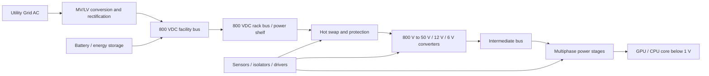
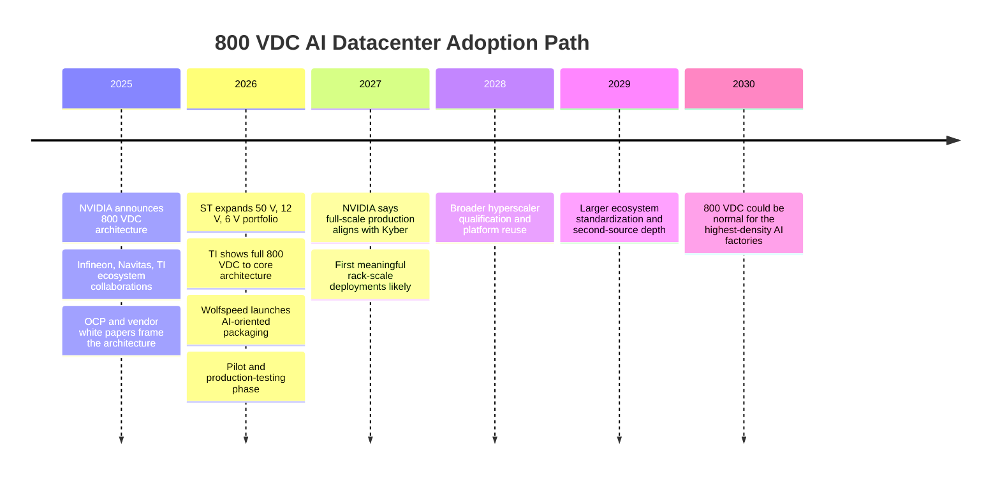

# Power Semiconductors for 800V AI Datacenter Power

## Executive summary

Power semiconductors are the switching and control devices that make modern AI datacenter power delivery possible. They sit in every major conversion stage, from utility-side rectification and energy storage interfaces to rack power shelves, intermediate bus converters, and the final GPU core voltage regulators. As rack power rises from roughly 100 kW today toward 600 kW to 1 MW in next-generation AI systems, the old 48 V in-rack approach becomes physically and economically strained because current gets too high, copper gets too heavy, and heat gets harder to remove. That is why hyperscale AI infrastructure is moving toward **800 VDC high-voltage direct current** distribution. NVIDIA has publicly positioned 800 VDC as the architecture for future AI factories, with full-scale production tied to Kyber rack-scale systems in 2027, and multiple semiconductor vendors now have reference designs or prototype boards aligned to that roadmap. citeturn29view0turn29view1turn2view4turn3search2turn30search2

The most important technical takeaway for investors is simple: **the winners will not just be “more chips” vendors; they will be the firms that can solve the whole high-voltage power chain**. In practice, that means a mix of 1.2 kV SiC MOSFETs for 800 V hot-swap, protection, and high-power conversion; GaN for very high-frequency, high-density converters; low-voltage MOSFETs and power stages for intermediate rails and point-of-load conversion; and the gate drivers, isolation, sensing, and control ICs that make the entire architecture safe and reliable. ST, TI, Navitas, Renesas, ROHM, Infineon, and onsemi have all publicly tied products to NVIDIA’s 800 VDC roadmap, while OCP materials show the broader ecosystem converging around this direction. citeturn2view3turn25view1turn29view1turn16view2turn31search0turn32search0turn4search7

My bottom-line investment view is that **800 VDC power semiconductors are likely to become an important multi-year theme, but the opportunity will be captured unevenly**. The best-positioned names are not identical. **Infineon** looks like the best broad non-U.S. franchise because it is already the global leader in power discretes and modules and is co-developing NVIDIA’s 800 V HVDC architecture. **onsemi** is the most interesting U.S.-listed balanced play because it has meaningful AI datacenter revenue already, a broad device portfolio from 0.8 V to 800 V, and wide-bandgap roadmaps that extend into late 2026. **Monolithic Power Systems** is the highest-quality U.S. compounder, but it is more of a “downstream GPU power” winner than an 800 V bus winner. **Texas Instruments** is the safest diversified U.S. enabler. **STMicroelectronics** is a strong foreign cyclical recovery candidate with very direct 800 VDC product relevance. **Navitas** and **Wolfspeed** are the high-beta speculative ways to play the theme. citeturn8view0turn10view1turn14view1turn29view0turn25view1turn16view2turn21view2

The key nuance is that **power semiconductors are not the only bottleneck**. In 2026, the harder constraints are still system integration, protection, thermal management, safety isolation, site-level electrical infrastructure, and standardization. But that is exactly why this theme matters for equity investors: if 800 VDC becomes the preferred architecture for the densest AI clusters, the semiconductor suppliers that solve these engineering pain points should gain pricing power, design-win stickiness, and larger content per rack. citeturn2view3turn29view1turn4search14turn4search7turn2view4

## Power semiconductors in AI datacenters

At a simple level, a power semiconductor is the device that **switches, routes, protects, or measures electrical energy**. In AI datacenters, these devices are not optional supporting parts. They are the reason power can move from the grid to the rack and then from the rack to the GPU core efficiently enough to make modern AI clusters economically viable. Infineon describes MOSFETs as voltage-controlled switches used to efficiently deliver power to a load, and TI explicitly frames future AI datacenter power delivery as a problem of re-architecting the path “from the grid to the gates of processors.” citeturn5search7turn29view1

The component stack is easier to understand if you think of the datacenter as a series of voltage changes. First, utility AC must be rectified and conditioned. Then high-voltage DC is distributed across the facility or rack. That high voltage is stepped down to an intermediate rail such as 50 V, 12 V, or 6 V. Finally, GPU and CPU cores are fed with sub-1 V rails at extremely high current. Each stage uses different power semiconductors and different packaging. ST’s 800 VDC portfolio illustrates this clearly: it now spans 800 VDC to 50 V, 800 VDC to 12 V, and 800 VDC to 6 V stages, and then hands off to low-voltage multiphase stages near the processor. TI’s architecture does something similar with 800 V to 6 V and then 6 V to below 1 V. citeturn25view1turn30search0turn29view1

The main device types matter because they map to different parts of the power tree:

| Device or function | What it does in plain English | Typical role in AI datacenters | Best fit for 800 V era |
|---|---|---|---|
| **Silicon MOSFET** | Fast electronic switch | Low- to mid-voltage DC-DC stages, secondary-side switching, point-of-load | Still very important below the 800 V bus |
| **IGBT** | High-voltage/high-current switch, but slower than MOSFET/GaN | Utility-side and some industrial high-power stages | More relevant at slower, higher-power stages than inside ultra-dense rack converters |
| **SiC MOSFET** | Wide-bandgap switch with lower switching loss and better high-temp operation | 800 V hot-swap, protection, PFC, SST, high-power DC-DC | One of the most important device classes for 800 VDC |
| **GaN** | Very fast wide-bandgap switch for high frequency and power density | Compact high-frequency converters, LLC stages, some intermediate-bus topologies | Critical for rack-level density, especially where multilevel architectures split voltage stress |
| **Diodes / rectifiers** | One-way current path, freewheel/rectify energy | PFC, rectification, protection, fast recovery paths | Often paired with SiC and silicon switches |
| **Power modules** | Multiple dies and thermal/mechanical packaging in one package | High-power shelves, SSTs, industrial rectifiers, compact rack stages | Packaging becomes a differentiator, not a commodity |
| **Gate drivers / isolators / sensors** | Control and protect the switching devices | Safe switching, isolation, fault handling, current/voltage measurement | Essential, especially at 800 V where protection becomes much harder |
| **Power stages / multiphase controllers** | Final current delivery into GPU/CPU rails | 12 V/6 V to sub-1 V conversion | Big beneficiary even if they do not switch the 800 V rail directly |

This synthesis comes from vendor product descriptions and application material from Infineon, ROHM, TI, ST, and Navitas. Infineon notes that IGBTs can handle up to 6.5 kV but typically operate at much lower switching frequencies, while ROHM highlights that SiC MOSFETs reduce switching loss and temperature-related resistance rise. TI and ST both show GaN taking a major role where frequency and density matter most. citeturn5search1turn5search2turn29view1turn2view3turn16view3

A useful way to visualize the architecture is this:

This block diagram reflects the public architectures described by NVIDIA, TI, ST, and onsemi, all of which show 800 VDC distribution feeding rack or tray-level DC-DC stages before final point-of-load conversion. citeturn30search2turn29view1turn25view1turn10view1

For investors, the most important distinction is this: **not all “AI power” stocks are playing the same layer**. Infineon, onsemi, ST, Navitas, ROHM, and Wolfspeed are more exposed to the **high-voltage and wide-bandgap** parts of the stack. MPS, TI, and some analog players have stronger exposure to the **intermediate bus and point-of-load** layers. Both matter, but the economics and risk profiles are different. citeturn2view4turn10view1turn14view0turn29view0

## What 800V HDC means

When people say **800 V HDC** in this context, they usually mean **800 VDC or 800 V HVDC within the datacenter power path**. The idea is to distribute a much higher DC voltage closer to the racks so that current falls sharply for the same amount of power. NVIDIA is explicit that its architecture evolves from today’s AC-heavy designs toward an all-800 VDC future, while Navitas points out that 800 VDC stays within the IEC low-voltage DC classification of 1,500 VDC or below. citeturn30search2turn15search12

Why does this matter? Because power equals voltage times current. If a rack needs 1 MW, then:

| Distribution voltage | Current required for 1 MW | Practical effect |
|---|---:|---|
| **48 V** | about **20,833 A** | Extremely heavy copper, large busbars, major thermal headaches |
| **400 V** | **2,500 A** | Much better, but still heavy at future AI rack densities |
| **800 V** | **1,250 A** | Far more manageable for megawatt-class racks |

The current math is straightforward, and it is consistent with the public examples from ST and TI showing that low-voltage distribution becomes unsustainable as AI rack power rises. ST notes that **600 kW at 48 V would require 12,500 A**, and TI says **a 1 MW rack at 48 V would need almost 450 pounds of copper**. citeturn2view3turn29view0turn29view1

The gains from moving to 800 VDC are system-level, not just device-level. NVIDIA and ST argue that higher-voltage DC reduces cable and busbar bulk, lowers the number of conversion steps, cuts heat, and improves efficiency. ST cites NVIDIA’s estimate that moving to 800 V can improve efficiency by up to **5%** versus current 54 V systems. Navitas says copper thickness can fall by **up to 45%**, and NVIDIA’s public material frames 800 VDC as the path to support future AI servers and smooth migration from legacy systems. citeturn2view3turn16view2turn30search2

This is why 800 V is not just “higher voltage for the sake of it.” Compared with 400 V or 48/54 V, it changes the design tradeoffs across the whole datacenter:

| Comparison | 48/54 V architecture | 400 V architecture | 800 V architecture |
|---|---|---|---|
| Rack current at very high power | Very high | Moderate | Lowest of the three |
| Copper / busbar burden | Worst | Better | Best |
| Conversion stages | More | Fewer than 48 V | Potentially the fewest |
| Thermal stress from I²R loss | Highest | Lower | Lowest |
| Safety / protection complexity | Lower voltage, easier hardware | Higher | Highest; protection and isolation become much harder |
| Best use case | Legacy racks and moderate density | Transitional systems | New highest-density AI clusters |

The benefits are real, but the trade-offs are also real. ST states that 800 V systems need new isolation and grounding systems, and that protection and fault handling become “a whole new dimension.” TI says safe 800 V operation requires high-voltage sensing, protection, solid-state relays, hot-swap functionality, battery monitoring, isolated gate drivers, and isolation. Siemens’ DC datacenter protection paper makes the same point from the electrical infrastructure side: wiring, grounding, coordination, arc flash mitigation, and ground-fault protection all become more critical in DC architectures. citeturn2view3turn29view1turn4search14

That leads to an important investor conclusion: **800 VDC raises the value of the “control and protection” silicon around the switches**. In a 48 V world, a good MOSFET can be enough. In an 800 V world, the winning solution increasingly includes the hot-swap controller, current sensors, isolation, battery monitoring, gate drivers, and software-like power management intelligence surrounding the switch. That favors companies with broad mixed-signal and power portfolios, not just bare die. citeturn29view1turn25view1turn10view1

## Are power semiconductors the bottleneck

The short answer is: **partly, but not mainly yet**.

800 VDC power semiconductors are an enabling technology, and they can become a bottleneck if the ecosystem scales faster than qualification, packaging, and protection technology. But based on current public evidence, the near-term constraint is less “there are no suitable devices” and more “the full 800 V system still has to be industrialized.” NVIDIA, TI, ST, Navitas, and OCP materials all show that the core device concepts already exist. The open question is how fast the industry can turn prototypes and de facto reference designs into standardized, serviceable, reliable mass deployments. citeturn3search2turn25view1turn29view1turn16view3turn4search7

On the **technical readiness** side, the news flow is strong. NVIDIA says full-scale production of 800 VDC datacenters should coincide with Kyber rack-scale systems in **2027**. ST says NVIDIA validated its 12 kW proof-of-concept board and moved into production testing, and ST’s March 2026 release added 12 V and 6 V architectures to its earlier 50 V stage so that it can now serve different AI server form factors. TI publicly showed a complete 800 VDC architecture at GTC 2026, including 800 V hot-swap, 800 V to 6 V conversion, and 6 V to core power. Navitas launched a “designed for production” 12 kW PSU using GaN and SiC at 97.8% efficiency and is co-developing NVIDIA’s 800 V HVDC architecture for 1 MW racks and beyond. citeturn3search2turn2view3turn25view1turn30search0turn29view0turn16view3turn16view2

On the **device availability** side, the picture is also better than many investors assume. 1.2 kV SiC MOSFETs are already in use for hot-swap and high-voltage stages; ST explicitly says its hot-swap protection circuit uses **1,200 V SiC**. GaN is already being used in compact, high-frequency conversion boards, but often in clever multilevel or stacked architectures where each device only sees part of the 800 V bus. ST’s examples include **650/700 V GaN** on the primary side and **100 V / 120 V GaN** or low-voltage MOSFETs on the secondary side. That means the industry does not need a single magic transistor to solve 800 VDC; it needs the right device mix and packaging at each stage. citeturn2view3turn3search1turn25view1

Where the **real bottlenecks** can still emerge is in five places.

First, **protection and fault management**. At 800 VDC, hot-swap, inrush, short-circuit response, isolation, and fault coordination become much more demanding. This is why TI emphasizes solid-state relays, hot swaps, battery monitors, isolated drivers, and sensors, and why Siemens emphasizes protection architecture rather than just devices. citeturn29view1turn4search14

Second, **thermal density and packaging**. As efficiency rises, absolute losses still remain large because total rack power is so high. Vendors are now advertising top-side cooled packages, custom package-level design, and very high power density as central differentiators. Wolfspeed’s TOLT package is explicitly aimed at AI datacenter thermal density, and ST says its solutions depend on custom design “at both chip and package levels.” citeturn21view0turn25view1

Third, **standards and interoperability**. OCP materials show an ecosystem moving toward 800 V and describe the 16:1 conversion stage as a fundamental architectural element, but this still looks more like an emerging industry direction than a fully commoditized standard. Much of the current ecosystem is being organized around NVIDIA’s reference design, which is powerful commercially, but still leaves room for timing risk or redesign across vendors. citeturn4search7turn30search2turn25view1turn29view0

Fourth, **supply chain concentration**. The underlying device supply picture is improving because large SiC build-outs for EVs and industrial power have already been funded, but concentration remains meaningful. Infineon is pulling in **€500 million** to accelerate AI-related capacity ramp. TI is ramping multiple 300 mm fabs. Wolfspeed stresses its vertically integrated U.S. 200 mm SiC chain. onsemi is sampling 700 V and 1,200 V vertical GaN with volume production targeted for late 2026. These are positive signs, but they also show that only a handful of firms have real control over the critical supply chain. citeturn8view1turn29view2turn21view2turn10view1

Fifth, **economics**. Wide-bandgap devices still cost more than legacy silicon on a device basis. The investment case works because 800 VDC can reduce copper, cut conversion stages, and shrink cooling and mechanical overhead at very high rack densities. That means the earliest and strongest adoption should happen in the most power-dense hyperscale AI clusters, not uniformly across all datacenters. ROHM’s white paper says the best architecture pairs SiC in the power-source stage with GaN in the IT rack, which is another way of saying that the system will be optimized for total cost and density, not for any single device material winning everywhere. citeturn31search0turn2view3turn16view2

So my investor judgment is this: **power semiconductors are not the main 2026 bottleneck, but they are likely to become one of the highest-value content layers in 2027-2030 AI infrastructure**. The raw switches exist. The investable edge lies in who can combine devices, drivers, packaging, and protection into production-grade platforms that hyperscalers will actually deploy. citeturn3search2turn25view1turn29view1turn21view0

A practical timeline looks like this:

This roadmap is anchored in NVIDIA’s 2027 target and the 2025-2026 vendor rollout cadence. citeturn3search2turn25view1turn30search0turn21view0

## Stock ideas and company analysis

The best way to invest in this theme is not with a single stock. The value chain is too broad. A sensible framework is: **core leaders**, **high-quality enablers**, and **speculative torque names**.

| Company | Listing | Why it matters for 800 V AI power | Revenue / exposure clues | My view |
|---|---|---|---|---|
| **Infineon** | IFX / IFNNY | Co-developing NVIDIA’s 800 V HVDC architecture; strongest “grid to core” power franchise | Global #1 in power discretes/modules at **17.4%** share; FY25 revenue **€14.662B**; AI/Data center was about **6%** of FY25 revenue mix; pulled forward **€500M** to accelerate AI capacity ramp | **Best broad non-U.S. core holding** |
| **onsemi** | ON | Broad portfolio from **0.8 V to 800 V**; AI datacenter content in tray, rack and UPS; Si, SiC, GaN, drivers | #2 in power discretes/modules at **8.5%** share; 2025 revenue **$6.0B**; AI datacenter revenue exceeded **$250M** in 2025 | **Best balanced U.S.-listed direct play** |
| **Monolithic Power Systems** | MPWR | Strongest exposure to intermediate bus and point-of-load rails feeding AI accelerators | 2025 enterprise data revenue **$701.8M** or **25.2%** of total; Q1 2026 enterprise data **$262.8M**, up **97.7% YoY**, now **32.7%** of revenue | **Best quality compounding AI power name** |
| **Texas Instruments** | TXN | Complete 800 VDC architecture with NVIDIA; strong in sensing, isolation, drivers, power management | 75% of 2025 revenue was in industrial, automotive and data center combined; data center called out as a fast-growth market | **Safest diversified U.S. enabler** |
| **STMicroelectronics** | STM | Directly aligned with NVIDIA’s 800 VDC reference design; now has 50 V, 12 V, and 6 V stages | #3 in power discretes/modules at **6.9%** share; 2025 total revenue **$11.8B**; P&D segment revenue **$1.685B** | **Good foreign cyclical recovery + direct 800 V relevance** |
| **Navitas** | NVTS | Pure-play GaN + SiC; very direct 800 VDC and PSU story; NVIDIA partner | 12 kW PSU at **97.8%**; 2025 revenue **$45.9M**, net loss **$117.0M**, cash **$236.9M**; pivoted to AI and high-power markets | **High-upside, high-hype, high-risk** |
| **Wolfspeed** | WOLF | Pure-play SiC leverage; AI datacenter packaging and high-voltage device angle | AI datacenter revenue up **50% QoQ** in FY26 Q2 and **~30% QoQ** in FY26 Q3; U.S. vertically integrated 200 mm SiC chain; post-bankruptcy turnaround | **Deep-value / distressed speculation only** |
| **ROHM** | 6963 JP | Official 800 VDC white paper and NVIDIA support; strong SiC + GaN mix | ROHM argues the optimal 800 V architecture uses **SiC** in the power-source stage and **GaN** in the IT rack | **Best Japanese satellite idea** |
| **Renesas** | 6723 JP | Official 800 VDC AI datacenter announcement; GaN and control breadth | Publicly tied next-generation power semis to 800 VDC AI datacenter architecture; also launched a bidirectional 650 V GaN switch for AI datacenters | **Interesting control-and-GaN foreign satellite** |

The market-share figures for Infineon, onsemi, and ST come from Omdia data reproduced in Infineon’s FY26 investor materials. Revenue and exposure details come from the companies’ own reports and press materials. citeturn8view1turn8view0turn10view0turn10view1turn14view1turn29view2turn25view1turn27view0turn16view0turn17view2turn21view2turn31search0turn32search0turn32search3

A current **U.S.-quoted valuation snapshot** is also useful, even though trailing earnings are distorted for some cyclical names:

| Company | Price | Market cap | Trailing P/E | Read-through |
|---|---:|---:|---:|---|
| **ON** | $116.20 | $45.8B | 85.4x | Trough-cycle earnings make P/E look optically high |
| **MPWR** | $1,589.81 | $78.3B | 113.8x | Premium multiple reflects quality and AI growth |
| **NVTS** | $29.25 | $6.73B | N.M. | Valuation is extremely speculative relative to revenue base |
| **WOLF** | $69.89 | $2.75B | N.M. | Balance-sheet and profitability risks dominate |
| **TXN** | $309.21 | $282.6B | 52.9x | Large-cap quality multiple, but low purity |
| **STM** | $66.86 | $60.4B | not shown in quote | Cyclical trough earnings reduce comparability |

These prices and market caps are from the latest available market data in the tool, dated May 22–23, 2026 UTC. citeturn33finance0turn33finance1turn33finance2turn33finance3turn33finance4turn33finance5

My **highest-conviction recommendations** are as follows.

**Infineon** is the cleanest strategic winner if you are comfortable owning a foreign stock. It is already the global leader in power discretes and modules; it is directly working with NVIDIA on the 800 V architecture; it has exposure across silicon, SiC, and GaN; and management is already accelerating AI capacity ramp. The stock is not a pure 800 V AI story because automotive still matters a lot, but that diversification is also a strength. citeturn2view4turn8view1turn8view0

**onsemi** is my preferred U.S.-listed stock for direct exposure. It checks the deepest number of boxes: broad voltage coverage, meaningful AI datacenter revenue already, system-level content from tray to UPS, and credible wide-bandgap roadmaps including vertical GaN. The biggest risk is that onsemi is still heavily tied to auto and industrial cycles, so the stock can trade on EV weakness even when its AI datacenter story improves. But that same mismatch can create opportunity if investors are still underestimating the AI power business. citeturn10view0turn10view1turn33finance0

**Monolithic Power Systems** is the best business, but not the purest 800 V name. If 800 VDC takes hold, MPS should still win because it monetizes the downstream rails that become even more critical as GPUs demand faster, denser power delivery. Enterprise Data already represented 25.2% of 2025 revenue and was nearly one-third of Q1 2026 revenue. The trade-off is valuation: the market already knows MPS is a premier AI power franchise. citeturn12view1turn14view1turn33finance1

**STMicroelectronics** is the best cyclical foreign recovery candidate among the direct 800 V names. Its public collaboration with NVIDIA is unusually concrete: it has 50 V, 12 V, and 6 V architectures and emphasizes custom chip-and-package co-design. The problem is that 2025 results were weak, especially in power and discrete, so this is not a “clean execution” story yet. It is more of a medium-risk turnaround with real 800 V upside. citeturn25view1turn27view0turn26view0turn33finance5

**Texas Instruments** is the conservative pick. TI is unlikely to be the highest-beta winner, but it has a real role in the architecture through hot-swap, sensing, isolation, control, and the 800 V to 6 V and 6 V to core path. If you want exposure to the theme without living with pure-play volatility, TXN is the easiest name to own. citeturn29view0turn29view1turn29view2turn33finance4

**Navitas** is the most exciting speculative name because the public narrative is almost perfectly aligned to the theme: GaN + SiC, pure-play positioning, NVIDIA collaboration, and very visible 12 kW high-density reference designs. The problem is that its current revenue base is still tiny relative to its market capitalization, and the stock already trades like the theme has largely arrived. This is a momentum-and-design-win name, not a margin-of-safety name. citeturn16view2turn16view3turn19view0turn17view2turn33finance2

**Wolfspeed** is for highly risk-tolerant investors only. The positive case is easy to see: pure SiC, U.S. domestic supply chain, AI-datacenter-specific packaging, and improving AI revenue momentum. The negative case is also obvious: restructuring history, weak profitability, and a business that still needs to prove a clean transition from auto-heavy exposure into AI infrastructure. citeturn21view0turn21view2turn23view0turn33finance3

## Scenarios, catalysts, and recommendations

My base case is that **800 VDC will become the preferred architecture for the most demanding new AI training clusters, but not for the entire datacenter market all at once**. Legacy 48/54 V and 400 V systems will not disappear overnight. Instead, the market should split: the highest-density AI factories migrate first, while mainstream enterprise and many retrofit deployments stay mixed for years. NVIDIA itself describes the architecture as a smooth migration path rather than an instant flip. citeturn30search2turn25view1

A scenario framework helps.

| Scenario | What happens | Approximate timeline | Likely winners |
|---|---|---|---|
| **Optimistic** | Pilot projects convert quickly into broad hyperscaler deployments; 800 V to 6 V / 12 V modules standardize faster than expected | 2026 pilots, 2027 first volume, 2028 broader rollouts | Infineon, onsemi, ST, TI, MPS, Navitas |
| **Base** | 800 VDC becomes the default for the densest new AI clusters, while mixed architectures persist elsewhere | 2026–2027 selective ramps, 2028–2030 broader adoption in new builds | Infineon, onsemi, MPS, ST, TI |
| **Pessimistic** | Protection, serviceability, capex, and standards issues slow adoption; 400 V and enhanced 48/54 V systems remain dominant longer | Meaningful broad adoption slips toward 2029+ | MPS and TI outperform direct HV DC names because downstream rails still grow |

This scenario work is grounded in NVIDIA’s 2027 target, OCP’s public architectural direction, and the current vendor rollout cadence. citeturn3search2turn4search7turn25view1turn30search0

A **SWOT-style summary** of the theme is also useful:

| Strengths | Weaknesses |
|---|---|
| Clear physics-driven savings in copper, current, and conversion steps | More complex protection, isolation, and serviceability |
| Supported by NVIDIA and a fast-growing ecosystem | Standards still maturing; broad deployment is not yet proven |
| Content per rack can rise materially | Wide-bandgap costs remain higher than legacy silicon |
| Benefits multiple semiconductor layers, not just one device type | Exposure is diluted at many large-cap vendors by auto/industrial cycles |

| Opportunities | Threats |
|---|---|
| 1 MW racks create outsized value for high-voltage power semis | Hyperscalers may move slower if economics or reliability disappoint |
| High-margin mix shift toward SiC/GaN, drivers, protection, packaging | Competing architectures can delay broad standardization |
| Deeper vendor lock-in via reference designs and qualification | Over-enthusiasm could lead to inflated valuations before revenue catches up |
| More semiconductor content in centralized HVDC architectures | Any slowdown in AI capex or GPU roadmap timing would ripple through the supply chain |

The strengths, weaknesses, opportunities, and threats above are directly consistent with NVIDIA, TI, ST, OCP, Siemens, and ROHM materials. citeturn2view4turn29view1turn25view1turn4search7turn4search14turn31search0

The **best catalysts to monitor** over the next 12–24 months are not generic earnings beats. They are architecture milestones:
the first confirmed production deployments tied to NVIDIA’s 2027 Kyber timeline; additional OCP standardization around 800 V racks and direct-current transformer topologies; new 1.2 kV SiC and high-voltage GaN production ramps; more 800 V to 6 V / 12 V production board validations; and evidence that energy storage is being integrated directly into the 800 VDC path. citeturn3search2turn4search7turn25view1turn10view1turn4search1

The **main risks to monitor** are equally specific:
whether 800 V protection and fault handling prove harder than expected in real deployments; whether top-side cooled and custom power packages yield reliably at scale; whether broad second-source ecosystems emerge or remain concentrated around a few suppliers; and whether investors start paying “2030 winner” multiples for companies that will not see meaningful revenue until 2027 or later. citeturn29view1turn21view0turn21view2turn16view0turn33finance2

If I were building an exposure list today, I would classify the names this way:

**Core positions:** Infineon, onsemi, Monolithic Power Systems.  
**Secondary quality positions:** Texas Instruments, STMicroelectronics.  
**Higher-risk satellites:** Navitas, ROHM, Renesas.  
**Speculative turnaround only:** Wolfspeed. citeturn8view1turn10view1turn14view1turn29view0turn25view1turn16view2turn31search0turn32search0turn21view2

## Key references and limitations

The most important sources behind this report were NVIDIA’s public 800 VDC architecture materials; TI’s and ST’s 800 VDC technical articles and product announcements; Infineon’s and onsemi’s investor materials; company annual reports and SEC filings for financial exposure; OCP’s power architecture paper; Siemens’ DC protection paper; and vendor white papers from Navitas and ROHM. These sources are especially valuable because they come from the companies actually building the power chain rather than from broad market commentary. citeturn30search2turn29view1turn25view1turn2view4turn10view1turn4search7turn4search14turn16view2turn31search0

There are also a few important limitations. Exact **800 V AI datacenter revenue** is rarely disclosed by public semiconductor companies, so revenue exposure is often inferred from segment mix, product announcements, or management commentary rather than reported as a clean line item. Market-share data are more available for broad power discretes/modules than for the narrower 800 VDC AI niche. Current valuation data in this report are strongest for U.S.-quoted names because live finance data were available there; foreign valuation multiples can differ depending on the exact primary listing or ADR used. Finally, some 2026 stock multiples are distorted by cyclical trough earnings, bankruptcy fresh-start accounting, or very early-stage revenue bases, so investors should not treat trailing P/E as a clean measure of normalized value for every company here. citeturn8view1turn10view0turn16view0turn21view2turn33finance0turn33finance1turn33finance2turn33finance3turn33finance4turn33finance5

Even with those limitations, the high-confidence conclusion remains intact: **800 VDC power delivery for AI datacenters is moving from concept to ecosystem build-out, and power semiconductors are one of the clearest ways to invest in that transition.** The best stocks are the ones that combine device technology, packaging, protection, and real customer alignment, not just the ones that can say “SiC” or “GaN” in a slide deck. citeturn3search2turn25view1turn29view0turn16view2turn21view0