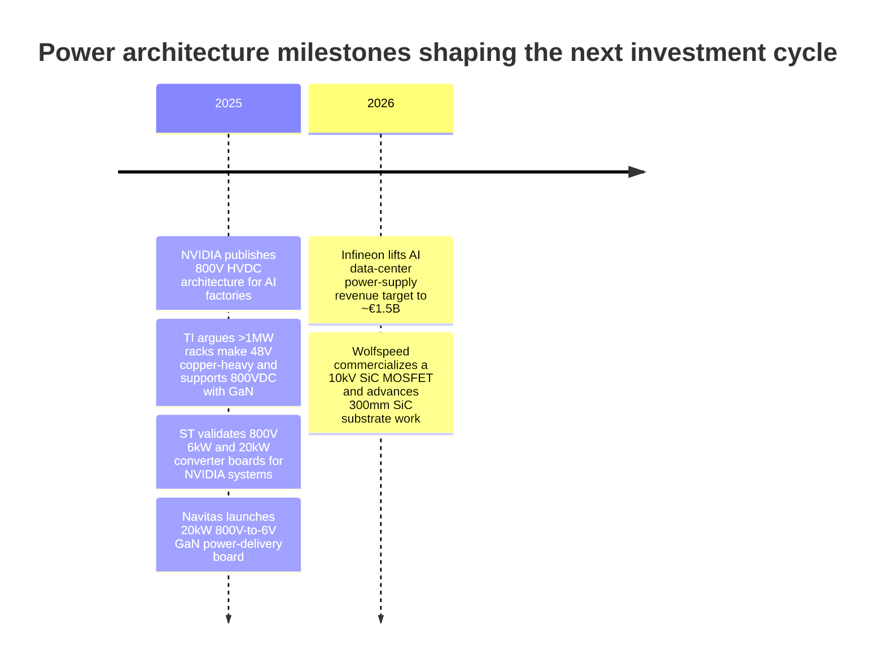
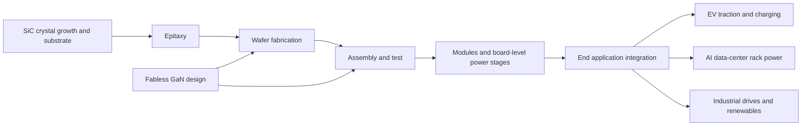

# Power Semiconductors Investment Research Report

## Executive summary

Power semiconductors are no longer a single cyclical semiconductor niche. They are now three overlapping investment themes: silicon carbide replacing silicon in high-voltage, high-temperature conversion; gallium nitride displacing silicon where switching frequency and power density matter most; and 800V architectures, especially in AI data centers and premium EVs, pulling more value into the power-conversion stack. Third-party market definitions vary, but the directional message is consistent: the total power semiconductor market is already measured in the tens of billions of dollars, the broader market is growing at a mid-single-digit rate, and the wide-bandgap subset is growing much faster. McKinsey has described the overall market as growing at more than 4% through 2030, while Yole projects the SiC device market to approach $10 billion by 2029 and the GaN power market to reach about $2.04 billion by 2029. Third-party sizing also suggests a roughly mid-$50 billion total power semiconductor market in 2025, while power discretes and modules alone were about $29.8 billion in 2024, which is closer to the part of the market most relevant to this report. citeturn4search10turn4search1turn4search2turn9search9turn9search13

My highest-conviction stocks for direct exposure are **onsemi** and **Monolithic Power Systems** among U.S.-listed names, and **STMicroelectronics** and **Infineon** among major foreign/ADR-accessible names. **Navitas** is the highest-purity public GaN option but still an execution story, while **Wolfspeed** is the highest-purity public SiC name and the highest-risk equity in the group after restructuring. onsemi offers the best combination of real SiC exposure, internal manufacturing, improving capital discipline, and reasonable valuation. MPWR has lower wide-bandgap purity, but it has the highest quality profile in the group and is already monetizing AI/server power demand at scale. ST and Infineon are the most complete foreign power franchises, with real 800V AI-rack programs, broad industrial and auto exposure, and the scale to win on packaging, qualification, and cost-down. citeturn19view0turn20view0turn19view2turn22view1turn21view1turn26search3turn37search1turn37search0turn36search9turn43view1turn43view2turn43view3

The main near-term mistake would be to treat all “power semiconductor” names as equal. The next 6–24 months will be dominated by inventory normalization, EV mix, China pricing, customer concentration, and AI power design wins. The next 3–5 years will be dominated by who best controls the cost stack from wafer to module to board-level solution. That distinction matters because the current cycle is already exposing the losers: Wolfspeed explicitly says slower-than-expected EV growth and Chinese capacity additions have created a supply imbalance in SiC wafers and devices, while Navitas is reshaping its business away from lower-margin China/mobile demand toward AI data centers, grid infrastructure, and industrial electrification. citeturn32view1turn31search7turn28view1turn28view5

## Market demand and growth outlook

At the top level, the key debate is not whether power semiconductors grow. It is **where the incremental dollar of demand lands**. The broad market still compounds steadily, but the fastest growth is moving toward wide-bandgap devices and system-level power architectures, especially where energy efficiency, thermal performance, and copper reduction matter most. That is why the sector is increasingly split into slower-growth silicon incumbents, SiC leaders in EV and industrial high voltage, and GaN leaders in compact, high-frequency conversion. citeturn4search10turn4search1turn4search2

The most important end-market shift is AI infrastructure. NVIDIA has publicly argued that legacy 54V rack architectures are not sufficient for future AI clusters and that 800V high-voltage DC architecture can cut cluster footprint and battery backup footprint materially while improving electrical efficiency. Texas Instruments separately says rack power demand is rising from roughly 100 kW toward more than 1 MW and notes that a 48V system at 1 MW would need almost 450 pounds of copper, making 800VDC architectures materially more attractive. Infineon’s annual report makes the investment case even more concrete: it said FY2025 AI-data-center power-supply revenue exceeded €700 million, raised its FY2026 target to around €1.5 billion, and sees its own addressable market in AI data-center power growing to €8–12 billion by the end of the decade. citeturn8view1turn43view0turn43view1turn41view0

EVs remain the single most important commercial outlet for SiC, but the near-term cycle is weaker than many investors expected. Wolfspeed’s FY2025 annual report is unusually candid here: it says slower-than-expected EV growth and increased global SiC production capacity, particularly in China, created a supply imbalance and a challenging pricing environment for SiC wafers and devices, especially in 150 mm. That does not break the long-term SiC thesis, but it does mean investors should not extrapolate earlier scarcity-era economics. In this part of the market, the winners will likely be the firms that can migrate to 200 mm, improve yields, and capture more of the module and packaging value stack. citeturn32view1turn35search0turn35search8

Industrial and renewables are the steadier, more diversified demand engine. Infineon’s Green Industrial Power business spans photovoltaic and wind inverters, storage, industrial drives, HVDC transmission, charging infrastructure, and traction systems for buses and industrial vehicles. Its Power & Sensor Systems segment also frames data centers, AI, 5G, and rooftop solar as core demand areas for Si, SiC, and GaN products. In other words, industrial and renewables are not a single market. They are a long tail of applications that tend to be lower profile than EVs but more resilient over a full cycle. citeturn41view0turn42view0

| Application | What the current evidence says | Investment implication |
|---|---|---|
| EVs | SiC remains central to high-voltage auto power, but 2025–2026 has been hit by slower EV growth and Chinese overcapacity in SiC wafers/devices. citeturn32view1 | Favor cost leaders and vertically advantaged players over balance-sheet-stretched pure plays. |
| AI datacenters | 800VDC is moving from concept to ecosystem buildout; NVIDIA, TI, ST, Navitas, and Infineon are all publicly discussing or shipping relevant architectures and boards. citeturn8view1turn43view0turn8view3turn31search0turn41view0 | This is the fastest-emerging incremental TAM. It benefits GaN, SiC, isolation, gate drivers, sensing, and board-level power. |
| Industrial | Recovery is mixed, but data-center-adjacent power, automation, and instrumentation are improving. MPWR’s industrial revenue grew 35.3% in 2025 from a smaller base. citeturn22view1 | Broad industrial power suppliers can outperform even without pure-play WBG exposure. |
| Renewables and grid | Storage, charging infrastructure, PV, wind, motor drives, and HVDC remain structurally favorable power-conversion markets. citeturn41view0turn42view0 | Best for diversified European/Japanese power franchises and module-heavy suppliers. |

## Technology landscape

The technology stack matters because “wide-bandgap” is not one thing. **SiC and GaN solve different engineering problems**, and 800V does not automatically mean either technology wins in every position in the system. In practice, investors should think in terms of where efficiency, thermal stress, switching speed, isolation, and packaging complexity create the most economic value. McKinsey’s framing is useful here: the total power market still grows steadily, but wide-bandgap penetration is where the mix upgrade happens. Yole’s much faster SiC and GaN forecasts say the same thing from a different angle. citeturn4search10turn4search1turn4search2

A useful investment shorthand is this. Silicon remains the cost leader where physics does not force a change. SiC is strongest where voltage, temperature, and efficiency make losses expensive. GaN is strongest where switching frequency and power density dominate. The next five years will therefore not be a clean one-for-one replacement cycle. They will be a system partitioning cycle, where original equipment manufacturers mix and match Si, SiC, GaN, controllers, isolation, sensing, and packaging according to each stage of the power chain. That is why platform breadth increasingly matters as much as transistor performance. citeturn43view0turn8view3turn31search0turn41view0

| Technology | Best fit | Why it wins | Where it is weaker | Best-public-market exposure |
|---|---|---|---|---|
| Silicon | Cost-sensitive, mature conversion stages | Lowest cost, mature manufacturing, huge installed base | Lower efficiency at higher voltage/current stress | TI, NXP, broad analog/power houses |
| Silicon carbide | High-voltage conversion, EV traction, fast charging, industrial drives, renewables, grid | Lower switching/conduction losses at high voltage, better thermal behavior | Higher cost, substrate/yield bottlenecks, price pressure in downcycles | onsemi, STM, Infineon, Wolfspeed, ROHM |
| Gallium nitride | High-frequency, high-density conversion, adapters, server power, emerging 800V rack stages | Power density, switching speed, smaller magnetics | Qualification/ramp path still earlier than silicon, system integration still evolving | Navitas, Power Integrations, Infineon, TI ecosystem exposure |

The importance of 800V is easiest to understand in system terms. In AI racks, TI and NVIDIA are both effectively making the same argument: higher voltage cuts current, which cuts copper, resistive losses, and physical bulk. NVIDIA adds the data-center-level benefit that 800V architecture can reduce both compute-cluster and battery-backup footprint meaningfully. ST has already validated 6 kW and 20 kW 800V power-conversion reference designs for NVIDIA systems, and Navitas has publicly launched a 20 kW 800V-to-6V power-delivery board using GaNFast devices and targeting up to 97.5% peak efficiency. This is why the sector is shifting from “which transistor is best” toward “which vendor can ship the whole power stage or win the reference architecture.” citeturn8view1turn43view0turn8view3turn31search0

## Supply chain and manufacturing map

The sector’s supply chain is where many equity outcomes will be decided. In traditional semis, investors often focus on design share. In power semis, **device cost, substrate quality, packaging, test, and qualification cycles** matter just as much. The bottlenecks are different by technology. For SiC, crystal growth, substrate defect density, epitaxy, 200 mm transition, and power module packaging are the major choke points. For GaN, the key issues are foundry qualification, yield learning, packaging, and system-level adoption. citeturn35search0turn35search8turn28view5turn8view3turn43view0

Wolfspeed remains the clearest listed example of vertical integration in SiC. It has described Mohawk Valley as the world’s first purpose-built, fully automated 200 mm SiC fab and has tied that fab to its own 200 mm materials output, while also continuing to push a 300 mm SiC platform and, more recently, advanced-packaging applications for AI data centers. That is strategically important because substrate plus device control is the cleanest route to cost-down, even if Wolfspeed’s current financial execution remains weak. citeturn35search0turn35search12turn34view4

Infineon is the best example of the diversified European model. It is ramping SiC production in Villach and Kulim, has begun 200 mm SiC product releases, funds R&D at roughly 15% of annual revenue, and says its FY2025 R&D spend was about €2.2 billion with roughly 29,700 patents and patent applications in the portfolio. That combination of internal manufacturing, process migration, and intellectual-property scale is a major reason Infineon is one of the best long-duration names in the sector. citeturn35search8turn35search5turn43view3

Fabless models are viable, but they create a different risk profile. Navitas is explicit that it is fabless and depends on third-party foundries, assembly houses, and test suppliers. It also says it relies on single sources for certain front-end services and limited suppliers for other materials. The offset is capital efficiency: management argues that the fabless model enables lower capex intensity, faster scaling, and flexibility, and management paired that argument with a November 2025 long-term strategic partnership with GlobalFoundries for high-power GaN. For investors, that means fabless WBG names generally carry less fixed-cost risk but more execution and supply-chain concentration risk. citeturn28view5turn28view3

Packaging and test are no longer back-end afterthoughts. ST’s NVIDIA-validated boards, TI’s 800VDC system requirements, and Navitas’s 20 kW 800V-to-6V board all point in the same direction: much of the future value capture will sit in complete reference platforms, thermal management, high-voltage isolation, and board-level integration. Investors who underwrite the theme as “just buy the transistor vendor” are likely to miss where the competitive moat is going. citeturn8view3turn43view0turn31search0

## Competitive landscape and company universe

The best way to think about the public-company universe is by **purity of exposure**. High-purity wide-bandgap names are Navitas, Wolfspeed, and ROHM. Medium-purity names are onsemi, ST, and Infineon, because they have major SiC or GaN programs inside broader businesses. Lower-purity but still highly relevant exposures are MPWR, TI, Power Integrations, and NXP, where the thesis is more about power-conversion content, AI rack power, and auto electrification than about pure-play SiC/GaN. That distinction should drive both valuation and position sizing. citeturn28view5turn35search0turn43view2turn43view3turn22view1turn43view0turn44search1turn44search5

Customer concentration is also very uneven. onsemi had one distributor at roughly 11% of FY2025 revenue. MPWR is much more distribution-heavy: 85% of 2025 sales were through distribution arrangements, and its top three distributors were 26%, 18%, and 10% of revenue. Navitas remains even more fragile: it has been reshaping its distribution network as part of its “Navitas 2.0” pivot to high-power markets and disclosed distributor concentration and a terminated distribution agreement in 2024. Wolfspeed said about one-third of FY2025 revenue came through distributors and is trying to diversify with wins such as Toyota and Hopewind. citeturn19view0turn27view1turn29view2turn33view0

### Verified current-metrics comparison

The table below emphasizes companies for which I verified both current quote data and recent primary-source operating data during this session. Price-to-sales is approximate and uses current market cap divided by the latest annual revenue, with local-currency consistency preserved for Infineon.

| Company | Ticker | Market cap | Latest annual revenue | Latest gross or segment margin | WBG exposure | Manufacturing model | Customer mix | Approx. P/S | Balance sheet snapshot | Sources |
|---|---|---:|---:|---:|---|---|---|---:|---|---|
| onsemi | ON | $28.6B | $6.0B FY2025 | 33.1% FY2025 GM | High SiC, emerging GaN | Mostly internal fabs | Auto and industrial heavy; one distributor 11% of FY2025 revenue | ~4.8x | Cash + ST investments $2.55B at FY2025; gross LT debt about $3.0B in Q1'26 | citeturn0finance0turn19view0turn20view0turn19view3turn17view1 |
| Monolithic Power Systems | MPWR | $77.6B | $2.79B FY2025 | 55.2% FY2025 GM | Low direct SiC/GaN purity, high power-content exposure | Fabless | 85% via distribution; top distributors 26%, 18%, 10% of FY2025 revenue | ~27.8x | Cash + ST investments $1.26B at FY2025; effectively net-cash, with no material debt disclosed in the annual filing | citeturn0finance3turn22view1turn21view1turn21view2turn27view1turn23view0 |
| Navitas | NVTS | $1.15B | $45.9M FY2025 | 39.0% non-GAAP GM in Q1'26 | Very high GaN and SiC purity | Fabless | High distributor concentration; pivoting away from China/mobile toward AI, grid, industrial | ~25.1x | Cash $221M at Q1'26; management says no debt | citeturn0finance2turn30view0turn31search0turn28view2turn28view5turn29view2 |
| Wolfspeed | WOLF | $1.89B | $757.6M FY2025 | -16% FY2025 GM; -27% Q3 FY2026 GM | Very high SiC purity | Vertically integrated SiC | About one-third through distribution; diversifying with new customer wins | ~2.5x | Cash + ST investments $1.16B at Q3 FY2026; still levered post-restructuring, but debt cost is coming down | citeturn0finance1turn32view0turn32view1turn34view1turn34view3turn34view4 |
| STMicroelectronics | STM | $35.5B | $11.8B FY2025 | 33.8% Q1'26 GM | High SiC, rising 800V rack exposure | Internal-heavy IDM | Broad auto, industrial, personal electronics mix | ~3.0x | FY2026 net capex target $2.0–2.2B; balance sheet not fully normalized in this table | citeturn0finance4turn37search0turn37search1turn40search0 |
| Infineon | IFNNY | €95.8B local listing market cap | €14.66B FY2025 | €5.75B gross profit, about 39.2% gross margin; 17.5% segment-result margin | High SiC and GaN, broadest power platform | Internal-heavy IDM | Diversified across auto, green industrial power, power & sensor, secure systems | ~6.5x local-currency basis | Cash €1.36B; gross debt/EBITDA 2.0x; investment-grade BBB+ | citeturn11search0turn42view1turn43view3turn42view4turn36search3 |

A few additional names are worth tracking even though I did not fully normalize current quote data for them in this session. **Texas Instruments** is a lower-purity but lower-risk 800V beneficiary because it is working with NVIDIA on 800VDC rack architecture and continues to invest in portfolio breadth, process, and package technologies while shifting more than 80% of revenue to direct customer relationships in 2025. **Power Integrations** remains an attractive fabless high-voltage power name with 55.0% nine-month 2025 gross margin, outsourced manufacturing, and meaningful distributor concentration through Avnet. **NXP** is more of an auto-electrification surrogate than a direct SiC/GaN play, but it still generated $1.729 billion of auto revenue in Q2 2025 with 56.5% non-GAAP gross margin and 1.8x net leverage. **ROHM** remains a relevant foreign SiC watchlist name, but I did not independently normalize its current operating statement in enough depth to include it in the verified table. citeturn43view0turn44search0turn44search6turn44search1turn44search10turn44search5turn12search5

## Financial quality and valuation

The sector is currently separating into two clear camps: **compounders with intact margins** and **capital-intensive recovery stories**. MPWR is the clearest compounder. FY2025 revenue rose 26.4% to $2.79 billion, gross margin held at 55.2%, operating margin was 26.1%, and Q1 2026 revenue reached a record $804.2 million with 55.3% GAAP gross margin and $1.37 billion of cash and short-term investments. This is not the cheapest stock in the universe. It is the highest-quality stock in the universe. Investors are paying for that quality, and they are also paying for unusually clear exposure to enterprise data, storage/computing, communications, and automotive power content. citeturn22view1turn21view1turn21view2turn26search3

onsemi is almost the mirror image. It is not the cleanest quality story today, but it may be the best risk-adjusted valuation story. FY2025 revenue fell to $5.995 billion from $7.082 billion, gross margin dropped to 33.1% from 45.4%, and the company recorded large inventory and manufacturing realignment charges. The favorable part of the story is capital discipline: capex fell from $1.54 billion in 2023 to $694 million in 2024 and then to $341 million in 2025. Q1 2026 revenue recovered to $1.51 billion and gross margin rebounded to 38.5%, although much of that rebound reflected the absence of prior-year inventory charges rather than a full demand recovery. That is exactly why onsemi is interesting: if the cycle improves only modestly, earnings power can still inflect sharply. citeturn20view0turn19view2turn17view1

Navitas is the purest public GaN accelerator, but the income statement remains tiny. FY2025 net revenue was just $45.9 million, down 45% from 2024, and the company remains loss-making. Still, the strategic pivot is clear: management is moving away from China/mobile into AI data centers, energy and grid infrastructure, performance computing, and industrial electrification; it says the goal is better predictability and gross-margin expansion, and the Q1 2026 data are at least directionally supportive, with non-GAAP gross margin at 39.0% and cash still above $220 million. For public-market investors, NVTS is best treated as a real-option on high-power GaN design wins, not as a standard value or quality investment. citeturn30view0turn31search0turn28view1turn28view5

Wolfspeed remains the most difficult name to underwrite. The long-term strategic assets are real: Mohawk Valley, materials-plus-devices vertical integration, customer validation in auto and industrial, a 10 kV commercial SiC MOSFET, and longer-term 300 mm substrate ambitions. But the financial reality is still harsh. FY2025 revenue was $757.6 million and gross margin was -16%, while Q3 FY2026 revenue was only $150 million with -27% gross margin. The balance sheet is better than it was before restructuring and liquidity was still about $1.16 billion at the end of Q3 FY2026, but this is still a capital structure and execution turnaround, not a normal semiconductor investment. citeturn32view0turn32view1turn34view1turn34view3turn35search12

The foreign leaders are fundamentally stronger. ST’s FY2025 revenues were $11.8 billion, and after a difficult downcycle the company reported Q1 2026 revenue of $3.10 billion and gross margin of 33.8%, while continuing to invest for 2026 net capex of $2.0–2.2 billion. Infineon reported FY2025 revenue of €14.662 billion, gross profit of €5.753 billion, operating profit of €1.515 billion, and 17.5% segment-result margin; it invested about €1.283 billion in FY2025 and then reported Q2 FY2026 revenue of €3.812 billion and 17.1% segment-result margin. The implication is straightforward: if an investor prioritizes resilience and breadth, STM and Infineon belong in the core bucket with ON and MPWR. citeturn37search0turn37search1turn40search0turn43view3turn36search9

## Ranked stock picks and portfolio construction

Presented below with **U.S.-listed names first**, as requested. On absolute business quality, however, **STM** and **Infineon** would also belong in the top tier.

1. **onsemi — ON**  
   The best U.S.-listed balance of real SiC exposure, internal manufacturing, and valuation. The near-term setup is an earnings-normalization story after a bad 2025: capex has collapsed, restructuring is largely behind it, and even a moderate recovery in vehicle electrification and industrial demand can generate significant operating leverage. Over 3–5 years, ON still has one of the clearest U.S. paths to monetizing SiC at scale. Risks are prolonged auto weakness, renewed underutilization, and China-led SiC pricing pressure. I would size this as a **core position**. citeturn19view0turn20view0turn19view2turn17view1

2. **Monolithic Power Systems — MPWR**  
   The highest-quality name in the whole universe. It is not the purest WBG exposure, but it is already winning in AI/server power, enterprise data, storage/computing, and automotive, while maintaining elite gross margins and a fortress balance sheet. The 6–24 month catalyst path is continued AI power-content ramp and upside revisions; the 3–5 year story is more value moving to tightly integrated board-level power solutions. The main risk is simply valuation. I would also size this as a **core position**. citeturn22view1turn21view1turn21view2turn26search3

3. **Navitas — NVTS**  
   The most direct U.S.-listed bet on public GaN adoption in 800V data-center power. The stock only works if the “Navitas 2.0” pivot is real and high-power design wins translate into volume, but management has aligned the company around that exact outcome, including the GlobalFoundries partnership and the 20 kW 800V-to-6V board announcement tied to NVIDIA’s ecosystem. Because revenue is still very small, this belongs in a **satellite growth** bucket rather than a core bucket. Risks are execution, distributor concentration, and slower-than-expected conversion from design wins to revenue. citeturn28view1turn28view5turn31search0

4. **Texas Instruments — TXN**  
   A lower-purity but lower-risk way to play the shift to 800V rack architecture. TI is publicly working with NVIDIA on 800VDC data-center power delivery, and its technical commentary makes clear that moving from 48V to much higher-voltage distribution is a real system-level trend. TI also emphasized in its 2025 annual report that more than 80% of revenue now transacts directly with customers and that its package and process investments continue to broaden the portfolio. This is a **quality hedge** inside the theme, not a pure-play WBG name. Risks are lower thematic purity and slower-moving industrial analog cycles. citeturn43view0turn44search0turn44search6

5. **Power Integrations — POWI**  
   Another lower-purity but very relevant power-conversion stock. The company’s disclosures still show high gross margin around the mid-50s, a capital-light outsourced manufacturing model, and broad exposure to high-voltage conversion. It is particularly attractive for investors who want power-density and high-voltage conversion exposure without the capex burden of an IDM. The trade-off is customer and distributor concentration, especially through Avnet, and less direct torque to automotive SiC. I would size it as a **mid-sized satellite**. citeturn44search1turn44search10

6. **Wolfspeed — WOLF**  
   The pure-play SiC option. If the market wants clean thematic purity, this is the name. If the market wants proof of execution, it is not. The bull case is that restructuring, capex collapse, debt-cost reduction, Mohawk Valley ramp discipline, and new design wins stabilize the model before industry conditions improve. The bear case is that gross margins remain deeply negative for too long. This should only be a **small speculative position**, if any. citeturn33view0turn34view1turn34view3turn34view4turn35search12

7. **NXP Semiconductors — NXPI**  
   Not a pure power-semi or WBG stock, but a credible broad auto-electrification surrogate with decent financial quality. NXP’s official disclosures show strong auto revenue and healthy non-GAAP gross margins, with leverage still manageable. I would own NXPI for the parts of the power semi story that live inside more complete auto-electronics platforms, not for direct SiC/GaN purity. Size this as a **supporting platform exposure**, not a theme core. citeturn44search5turn44search8turn44search11

8. **STMicroelectronics — STM**  
   If foreign/ADR exposure is acceptable, STM should be one of the top names on almost any serious list. It has real SiC credibility, direct NVIDIA-validated 800V board work, broad automotive and industrial reach, and substantial operating leverage if the cycle improves. The near-term path is cyclical recovery plus AI/data-center momentum; the long-term path is deeper SiC and module share. The risks are capex intensity and renewed weakness in automotive/industrial demand. This is a **core foreign complement**. citeturn37search0turn37search1turn8view3turn40search0

9. **Infineon — IFNNY**  
   The broadest strategic winner in the group. Infineon already has the power-franchise breadth most competitors want, plus a strong IP position, visible R&D intensity, active 200 mm SiC migration, and the most explicit AI-data-center revenue disclosure among the major diversified suppliers. In the near term, the stock is a recovery plus AI-power beneficiary; over 3–5 years, it is one of the best ways to own the move from device vendor to power-architecture platform. Risks are mostly valuation and cyclicality, not existential execution. This is also a **core foreign complement**. citeturn43view1turn43view2turn43view3turn35search5turn36search9

10. **ROHM — ROHCY**  
   A smaller-cap foreign SiC watchlist name and a valid way to add purity to the basket, but with less current-session underwriting depth than the names above. Public quote data show it remains meaningfully smaller than the diversified leaders, which is attractive if the SiC cycle tightens again. The problem is that I did not verify its latest full operating profile deeply enough in this session to rank it higher. Treat it as an **optional satellite**, not a first-line core holding. citeturn12search5

### Suggested position sizing

For a dedicated **power-semiconductor sleeve**, I would split capital into three buckets rather than equal-weighting everything.

**Core compounders and scaled leaders** should be the majority: ON, MPWR, STM, and Infineon. A practical framework is roughly **60–70% of the sleeve** spread across those four names, with ON and MPWR largest.

**Satellite growth exposures** should be smaller: Navitas, Power Integrations, and optionally NXP or TI. That bucket can be **20–30% of the sleeve**, with NVTS smaller than the others because the revenue base is still tiny.

**Speculative optionality** should be small by design: Wolfspeed and optionally ROHM. I would cap this entire bucket at **5–10% of the sleeve**, and WOLF itself at the low end of that range.

If you wanted only a concentrated basket, the cleanest **four-stock version** would be **ON, MPWR, STM, and IFNNY**. If you wanted only U.S.-listed names, the cleanest **four-stock version** would be **ON, MPWR, NVTS, and TXN**, with the understanding that the last two serve very different roles.

## Open questions and limitations

Market definitions vary materially across sources. Some reports measure the **entire** power semiconductor market; others measure only **power discretes and modules**; still others isolate only the **SiC** or **GaN** subset. That is why I emphasized direction and relative positioning over false precision in top-down percentages. citeturn9search9turn9search13turn4search10turn4search1turn4search2

I verified current quote data and recent primary-source operating data most thoroughly for **ON, MPWR, NVTS, WOLF, STM, and Infineon**. I included **TXN, POWI, NXPI, and ROHCY** in the ranked list because they are clearly relevant to the theme, but I did **not** fully normalize every current valuation statistic for those names in this session. That is why they appear as secondary or lower-ranked ideas rather than in the fully verified comparison table. citeturn43view0turn44search1turn44search5turn12search5

The most important open fundamental question for the group is not whether AI power demand is real. It clearly is. The central open question is how much of that value remains with device vendors versus migrating upward into modules, reference boards, and full rack-level power architecture. The public disclosures from TI, NVIDIA, ST, Navitas, and Infineon strongly suggest that the value pool is moving higher in the stack. That favors companies with platform breadth and packaging depth over narrow die-only stories. citeturn8view1turn43view0turn8view3turn31search0turn43view1